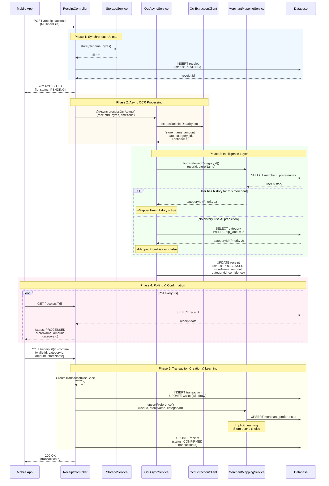
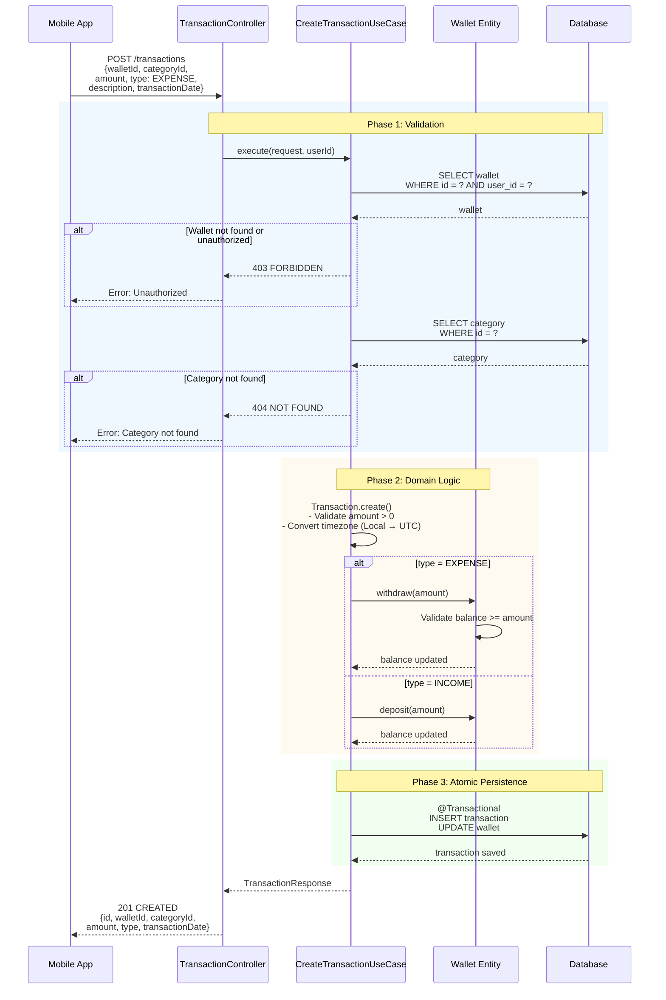
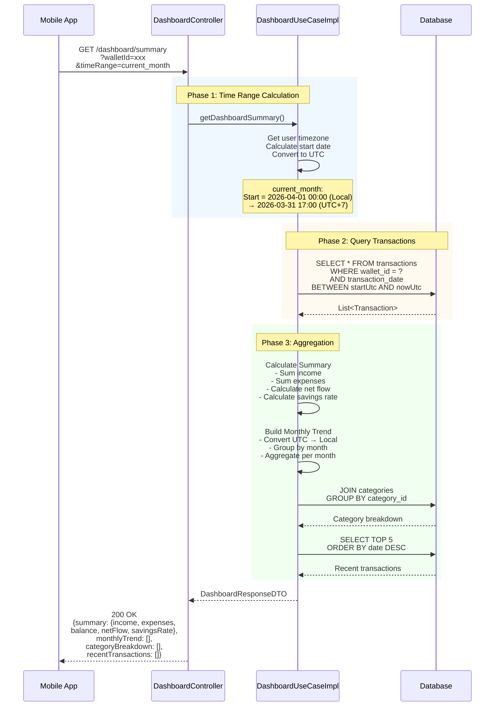
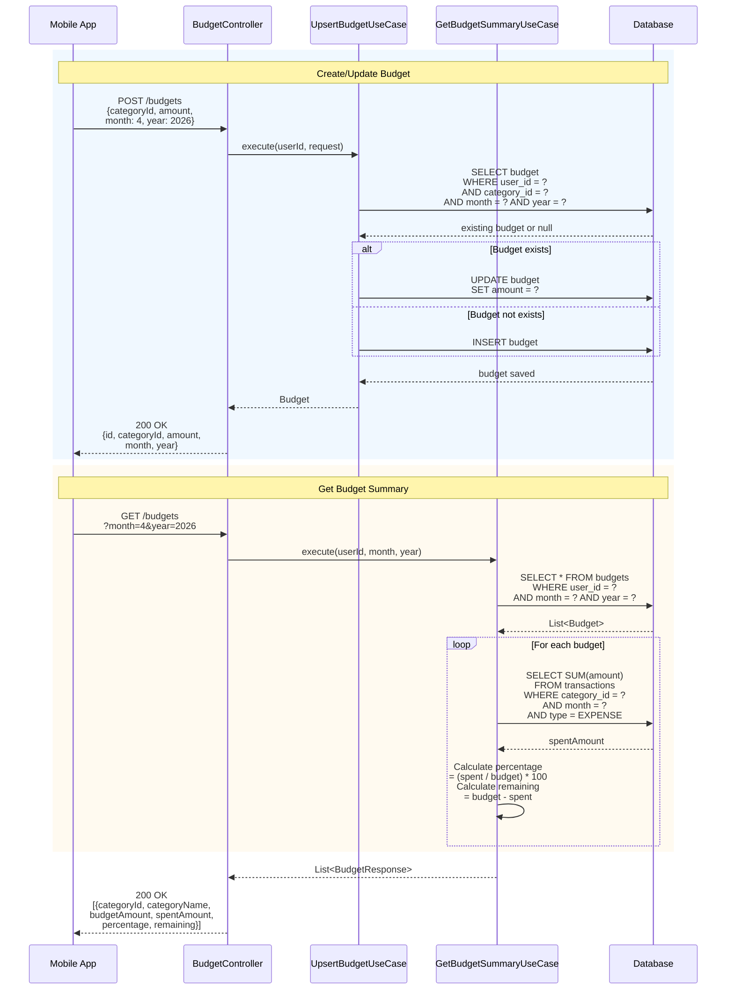
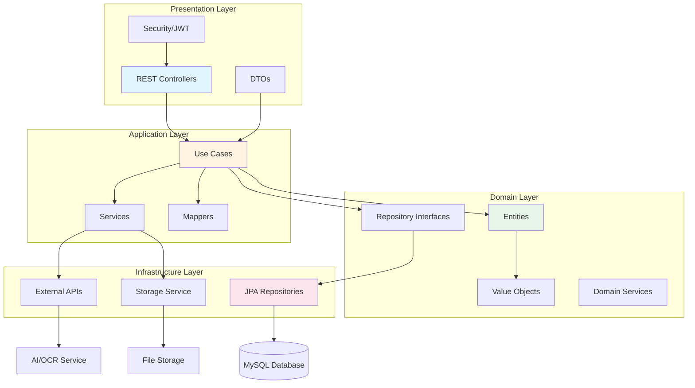
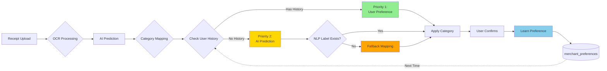
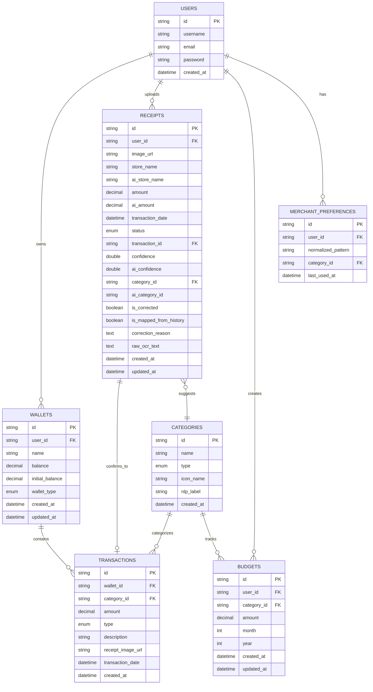
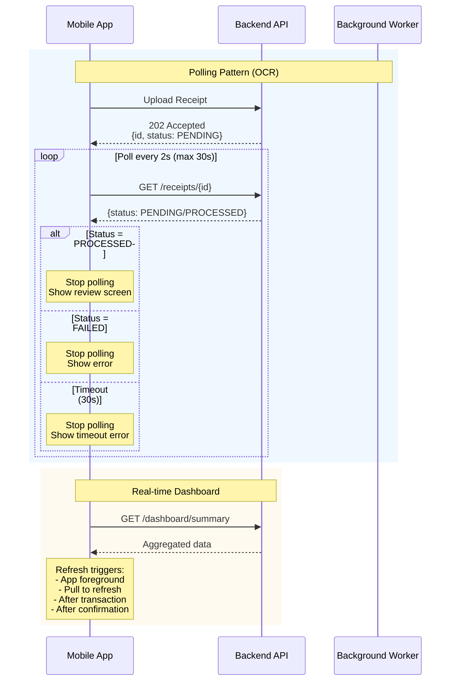

# Smart Personal Finance Management System - E2E Data Flow

## Core Features Data Flow Diagrams (Mermaid)

### 1. OCR Receipt Processing Flow (Async)



---

### 2. Manual Transaction Creation Flow



---

### 3. Dashboard Summary Flow



---

### 4. Budget Management Flow



---

## System Architecture Overview



---

## Intelligence Layer Architecture



---

## Database Schema (Post-Optimization)



---

## Data Flow Principles

```mermaid
graph TD
    A[User Input<br/>Local Timezone] --> B[Application Layer]
    B --> C{Operation Type}
    
    C -->|Write| D[Convert to UTC]
    D --> E[(Database<br/>UTC Storage)]
    
    C -->|Read| F[Query UTC Data]
    E --> F
    F --> G[Convert to User TZ]
    G --> H[Display to User]
    
    I[Transaction Operations] --> J{@Transactional}
    J --> K[Update Transaction]
    J --> L[Update Wallet]
    K --> M{Commit or Rollback}
    L --> M
    M -->|Success| N[Both Saved]
    M -->|Failure| O[Both Rolled Back]
    
    style D fill:#FFE4B5
    style G fill:#E0FFE0
    style M fill:#FFB6C1
```

---

## Mobile App Integration Pattern



---

## Key Features Summary

### 1. Timezone Management
- **Input**: User's local timezone
- **Storage**: UTC in database
- **Display**: Convert back to user timezone
- **Aggregation**: Group by local time for accurate monthly reports

### 2. Transaction Integrity
- `@Transactional` annotation ensures atomicity
- Wallet balance + Transaction creation in single DB transaction
- Automatic rollback on any failure

### 3. Async Processing
- OCR processing runs in background (`@Async`)
- Non-blocking upload (202 Accepted)
- Mobile polls for completion

### 4. Intelligence Layer
- **Priority 1**: User confirmation history (merchant_preferences)
- **Priority 2**: AI category prediction
- **Fallback**: Smart category mapping
- **Learning**: Every confirmation updates preferences

### 5. Security
- JWT authentication on all endpoints
- User ownership validation
- Resource-level authorization

---

**Generated**: 2026-04-15  
**Version**: 2.0 (Mermaid Charts)  
**Status**: Post Schema Optimization ✅
