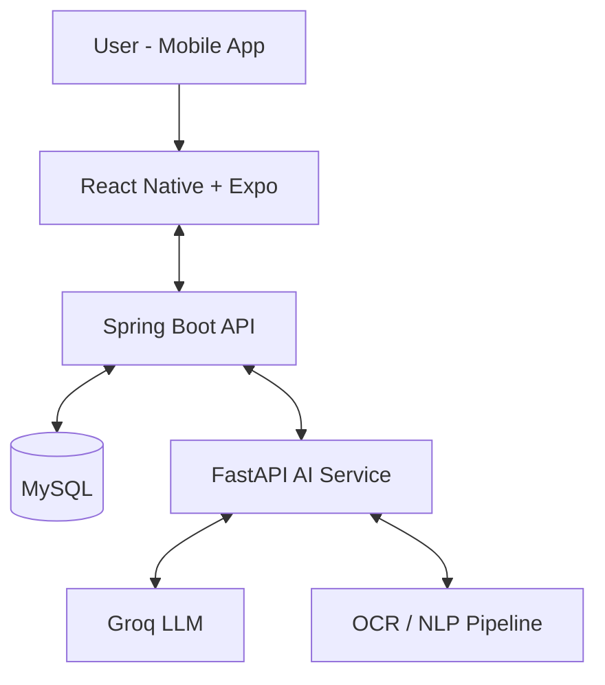

# Smart Personal Finance Management System

[](https://opensource.org/licenses/MIT)
[](https://spring.io/projects/spring-boot)
[](https://reactnative.dev/)
[](https://groq.com/)

Nền tảng quản lý tài chính cá nhân đa nền tảng, kết hợp **mobile app**, **backend API** và **AI service** để tự động ghi nhận giao dịch, phân tích chi tiêu và đưa ra gợi ý tài chính theo ngữ cảnh người dùng.

## Mục tiêu dự án

Dự án hướng đến việc biến quản lý tài chính cá nhân thành trải nghiệm đơn giản và thông minh hơn thông qua:

- Giảm thao tác nhập liệu thủ công khi theo dõi thu/chi.
- Tự động chuẩn hóa và phân loại giao dịch từ nhiều nguồn dữ liệu.
- Cung cấp góc nhìn tổng quan về dòng tiền để hỗ trợ ra quyết định tài chính tốt hơn.

## Tổng quan kiến trúc

Hệ thống được tổ chức theo mô hình service tách lớp rõ ràng:

- **Mobile App (`mobile/`)**: Ứng dụng React Native (Expo) cho trải nghiệm người dùng cuối.
- **Backend API (`backend/`)**: Spring Boot cung cấp REST API, xác thực JWT và nghiệp vụ tài chính.
- **AI Service (`ai-service/`)**: FastAPI xử lý NLP/OCR và tích hợp LLM (Groq) cho phân tích thông minh.
- **Database**: MySQL lưu trữ dữ liệu tài khoản, ví, giao dịch và các thực thể nghiệp vụ.



## Tính năng nổi bật

- **Ghi nhận giao dịch thông minh**: Hỗ trợ đầu vào từ văn bản, hình ảnh hóa đơn và ngữ cảnh giao dịch.
- **Phân loại chi tiêu tự động**: Chuẩn hóa dữ liệu và gợi ý danh mục chi tiêu phù hợp.
- **Phân tích và tư vấn tài chính**: AI hỗ trợ tóm tắt xu hướng chi tiêu và đưa khuyến nghị cá nhân hóa.
- **Xác thực và bảo mật**: JWT-based authentication với kiến trúc backend rõ ràng, dễ mở rộng.
- **Triển khai linh hoạt**: Có thể chạy full stack bằng Docker Compose hoặc chạy hybrid local.

## Công nghệ chính

| Thành phần | Công nghệ                                                     |
| :--------- | :------------------------------------------------------------ |
| Mobile     | React Native, Expo Router, NativeWind, React Query            |
| Backend    | Java 17, Spring Boot 3, Spring Security, Spring Data JPA, JWT |
| AI Service | Python, FastAPI, Groq API, NLP/OCR pipeline                   |
| Database   | MySQL 8                                                       |
| DevOps     | Docker, Docker Compose, PowerShell scripts                    |

## Cấu trúc thư mục

```text
.
├── ai-service/          # Dịch vụ AI/NLP/OCR (FastAPI)
├── backend/             # REST API và business logic (Spring Boot)
├── mobile/              # Ứng dụng di động (React Native + Expo)
├── infrastructure/      # Scripts và tài nguyên hạ tầng
├── docker-compose.yml   # Orchestration local environment
└── package.json         # Scripts điều phối toàn dự án
```

## Quick Start

### Yêu cầu môi trường

- Node.js **22.x** và npm **11.x**
- Java **17+**
- Docker & Docker Compose
- Groq API Key

### 1) Clone và cài đặt

```bash
git clone https://github.com/Anphan0612/Smart-Personal-Finance-Management-System.git
cd Smart-Personal-Finance-Management-System
npm install
```

### 2) Đồng bộ file môi trường

```bash
npm run sync-env
```

> Sau bước này, cập nhật các biến cần thiết trong `.env` (đặc biệt là `GROQ_API_KEY`, thông tin DB, JWT secret).

### 3) Chạy hệ thống

**Cách A — Full stack với Docker (khuyến nghị):**

```bash
npm run dev:docker
```

**Cách B — Hybrid (DB Docker + service local):**

```bash
npm run dev
```

### 4) Chạy mobile app

```bash
cd mobile
npm install
npm run start
```

## Các lệnh thường dùng

```bash
# Chạy toàn bộ services bằng Docker Compose
npm run dev:docker

# Dừng Docker Compose
npm run docker:down

# Chạy workflow phát triển local/hybrid
npm run dev

# Lint toàn repo (nếu áp dụng)
npm run lint
```

## Tình huống sử dụng phù hợp

- Người dùng cá nhân muốn theo dõi chi tiêu hằng ngày với ít thao tác nhập tay.
- Ứng dụng fintech cá nhân cần nền tảng backend + AI để mở rộng nhanh.
- Dự án học tập/thực nghiệm về kiến trúc đa dịch vụ (Mobile + Spring Boot + AI).

## Lộ trình phát triển (gợi ý)

- Đồng bộ dữ liệu từ nhiều nguồn ngân hàng/ví điện tử.
- Mở rộng bộ quy tắc phân tích hành vi chi tiêu nâng cao.
- Bổ sung dashboard web quản trị và báo cáo sâu hơn.

## License

Phát hành theo giấy phép **MIT**.
