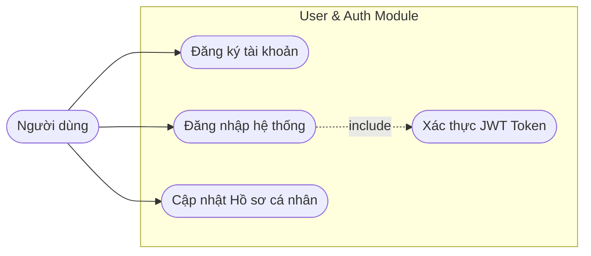
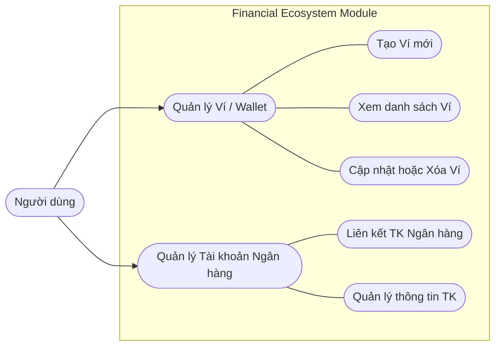
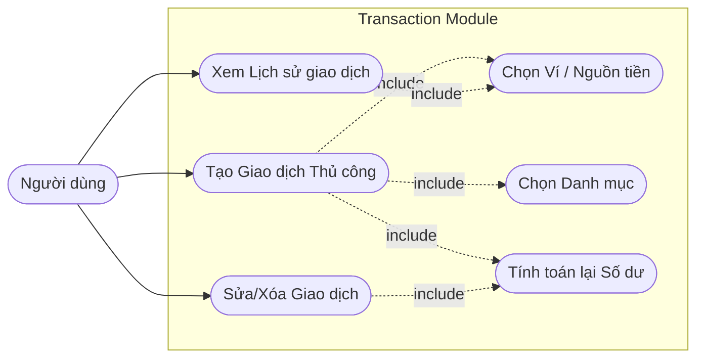
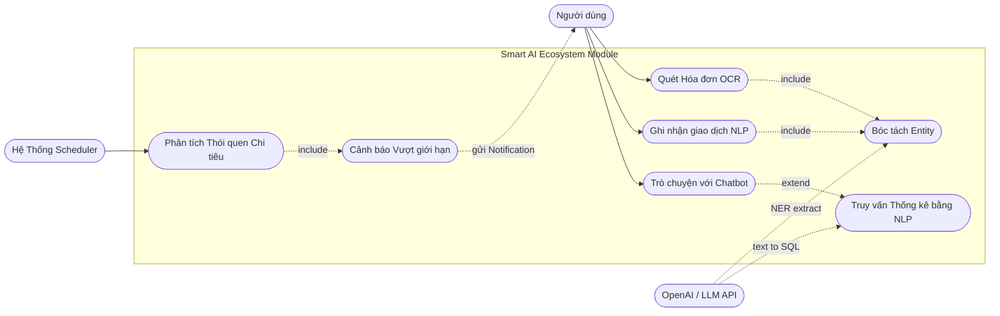

# Tổng hợp Yêu cầu Nghiệp vụ và Use Case Diagrams (Use Case Synthesis)

Dựa trên tài liệu yêu cầu ban đầu (`requirement.md`, `usecase-specifications.md`) và mã nguồn Clean Architecture thực tế đã được lập trình ở thư mục `application/usecase`, hệ thống Smart Personal Finance Management được chia thành **4 luồng nghiệp vụ cốt lõi**. 

Dưới đây là phần tổng hợp phân rã các Use Case kèm theo Sơ đồ Use Case (dùng cú pháp Flowchart của Mermaid) cho từng nhóm nghiệp vụ.

---

## 1. Nghiệp vụ Quản lý Tài khoản (User & Authentication)

Nghiệp vụ này đóng vai trò bảo mật và phân quyền cho người dùng truy cập ứng dụng.

**Các Use Cases:**
- Đăng nhập (`LoginUseCase`)
- Đăng ký tài khoản (`RegisterUserUseCase`)
- Quản lý Profile (Bổ sung CCCD, SĐT, Avatar)

---

## 2. Nghiệp vụ Quản lý Nguồn tiền (Wallet & Bank Account)

Người dùng không chỉ ghi nhận thu chi trên một "Sổ tổng" mà quản lý dòng tiền chi tiết qua nhiều nguồn: Ví tiền mặt/điện tử và Tài khoản ngân hàng.

**Các Use Cases (Đã implement code):**
- Thêm/Sửa/Xóa Ví (`CreateWallet`, `UpdateWallet`, `DeleteWallet`)
- Xem và Lấy chi tiết Ví (`GetWalletsByUserId`, `GetWalletById`)
- Thêm/Sửa/Xóa Tài khoản Ngân hàng (`CreateBankAccount`, `UpdateBankAccount`, `DeleteBankAccount`)
- Xem danh sách TK Ngân hàng (`GetBankAccountsByUserId`, `GetBankAccountById`)

---

## 3. Nghiệp vụ Quản lý Giao dịch cốt lõi (Transaction Management)

Hệ thống cho phép người dùng tự tay khai báo các giao dịch thu/chi hoặc chuyển tiền giữa các Ví/Tài khoản.

**Các Use Cases (Đã implement code):**
- Thêm giao dịch (`CreateTransactionUseCase`)
- Cập nhật, chỉnh sửa giao dịch (`UpdateTransactionUseCase`)
- Xóa giao dịch do nhập sai (`DeleteTransactionUseCase`)
- Truy xuất Lịch sử giao dịch theo số Ví (`GetTransactionsByWalletIdUseCase`)
- Xem chi tiết 1 giao dịch (`GetTransactionByIdUseCase`)
- Thống kê Số dư (Tính toán dựa trên `amount` và `type`)

---

## 4. Nghiệp vụ Thông minh & AI (Smart NLP / AI Module)

Đây là giá trị cốt lõi tạo nên sự khác biệt ("Smart") của hệ thống, giúp người dùng lười cũng có thể quản lý tài chính hiệu quả. Nhóm này đại diện cho UC-02 đến UC-05 trong đặc tả.

**Các Use Cases:**
- Nhập liệu bằng Ngôn ngữ Tự nhiên (NLP Input / Speech to Text)
- Quét Hóa đơn (OCR/Image AI)
- Truy vấn tài chính qua Trợ lý ảo (Chatbot Assistant)
- Tự động Phân tích & Cảnh báo chi tiêu (Anomaly Alert - Tác nhân là Hệ thống)

---

## Tổng kết (Summary of Actors)

1. **Người dùng (End-User):** Chủ thể khởi tạo toàn bộ các nghiệp vụ liên quan đến tài sản của mình, với thao tác từ đăng nhập, tạo ví, nhập giao dịch cho đến chat với AI.
2. **Hệ Thống Phân Tích (System Job):** Chạy ngầm định kỳ nhằm đánh giá `transactions` và `budgets` để đẩy ra các cảnh báo (`AI_Alert`) phù hợp.
3. **OpenAI / AI Engine (External Actor):** Đảm nhiệm các tác vụ phức tạp liên quan tới NLP (Text-to-JSON, Intent Classification) và OCR mà hệ thống nội bộ không tự xử lý logic tĩnh.
