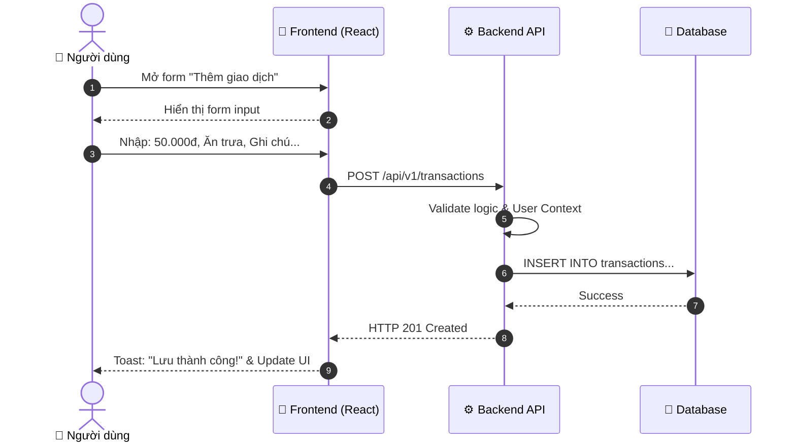
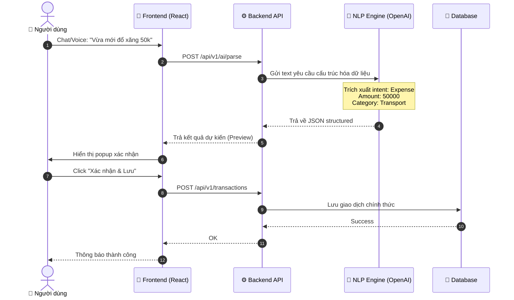
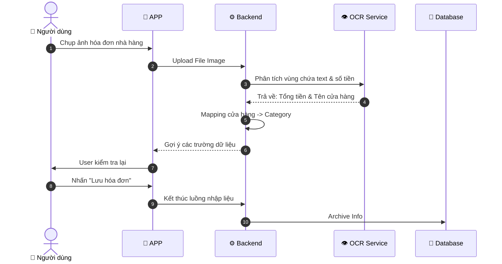
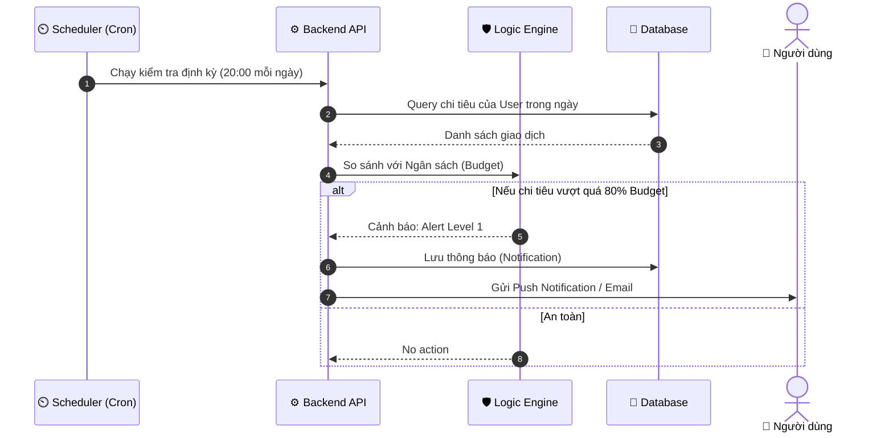
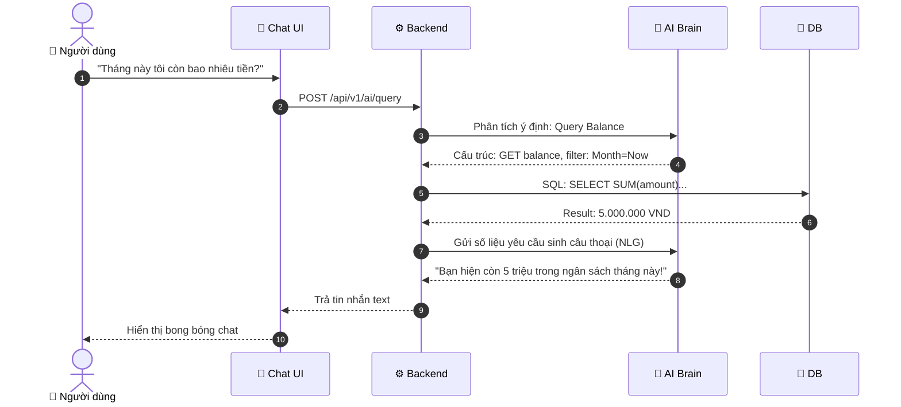

# 🔄 Business Flow Diagrams

Tài liệu này mô tả chi tiết các luồng nghiệp vụ người dùng tương tác với hệ thống, từ nhập liệu thủ công đến các tính năng AI nâng cao.

---

## 1. ✍️ Nhập Giao dịch Thủ công (Manual Entry)

Đây là chức năng cơ bản nhất giúp người dùng kiểm soát chính xác từng khoản chi tiêu.

---

## 2. 🧠 Nhập liệu qua AI (NLP Input)

Tự động hóa việc trích xuất thông tin giúp giảm tải thao tác cho người dùng.

---

## 3. 📷 Quét Hóa đơn (OCR Feature)

Sử dụng Computer Vision để đọc dữ liệu trực tiếp từ hóa đơn.

---

## 4. 🚨 Cảnh báo Chi tiêu Bất thường (Anomaly Detection)

Hệ thống chủ động giám sát và đưa ra các khuyến nghị bảo vệ ngân sách.

---

## 5. 🤖 Truy vấn qua Chatbot (AI Assistant)

Hỏi đáp trực tiếp về tình hình tài chính bằng ngôn ngữ tự nhiên.

---
*Các quy trình trên đảm bảo tuân thủ tiêu chuẩn bảo mật OWASP và hiệu năng tối ưu.*

