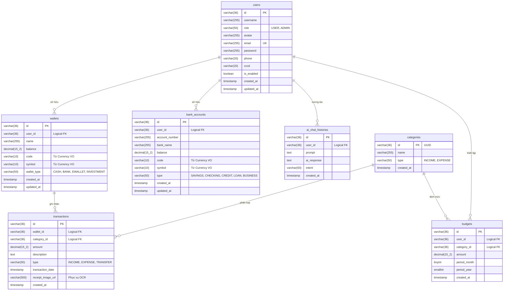

# Thiết Kế Cơ Sở Dữ Liệu (Database Design)

Tài liệu này định nghĩa cấu trúc Cơ sở dữ liệu cho dự án **Smart Personal Finance Management System**, được ánh xạ chính xác từ thiết kế của các Java Domain Entities (Aggregate Roots và Value Objects) áp dụng theo mô hình Clean Architecture / DDD.

Mọi bảng biểu, kiểu dữ liệu và khoá ngoại (Logical Foreign Keys) đều phản ánh 100% cấu trúc mã nguồn thực tế ở package `domain.entities`.

---

## 1. Lược đồ Thực thể - Mối quan hệ (ERD)

---

## 2. Chi tiết các Bảng (Tables Info)

Hệ quản trị CSDL mục tiêu: **MySQL 8.0+**

> **💡 Lưu ý về Foreign Key (Khoá ngoại)**: Theo mô hình thiết kế hướng sự kiện của Backend (Aggregate Roots), các bảng giao tiếp dựa trên UUID (Chuỗi mã định danh, Logical FK). Vì thế, khi tạo bảng, có thể Không áp dụng "strict foreign key constraints" (tuỳ theo chiến lược Indexing và Migration của JPA/Flyway) nhằm phục vụ Sharding trong tương lai. Ở thiết kế này, chúng ta định nghĩa các trường ID là `VARCHAR(36)`.

### 2.1 Các Bảng Core & Giao dịch Khớp với Source Code

| Bảng | Cột | Kiểu dữ liệu | Ràng buộc | Mô tả |
| :--- | :--- | :--- | :--- | :--- |
| **users** | `id` | VARCHAR(36) | PK | Mã hệ thống tạo UUID |
| | `username` | VARCHAR(255) | NOT NULL | Tên hiển thị người dùng |
| | `role` | VARCHAR(50) | | Enum `UserRole`: USER, ADMIN |
| | `avatar` | VARCHAR(255) | NULL | Link ảnh đại diện |
| | `email` | VARCHAR(255) | UNIQUE, NOT NULL | Email đăng nhập |
| | `password` | VARCHAR(255) | NOT NULL | Chuỗi hash mật khẩu (BCrypt) |
| | `phone` | VARCHAR(20) | NULL | Số điện thoại |
| | `cccd` | VARCHAR(20) | NULL | Số CCCD bảo mật |
| | `is_enabled` | BOOLEAN | DEF TRUE | Trạng thái kích hoạt |
| | `created_at` | TIMESTAMP | NOT NULL | Thời gian tạo tài khoản |
| | `updated_at` | TIMESTAMP | | Lần cập nhật cuối |

| Bảng | Cột | Kiểu dữ liệu | Ràng buộc | Mô tả |
| :--- | :--- | :--- | :--- | :--- |
| **categories** | `id` | VARCHAR(36) | PK | Mã danh mục UUID |
| | `name` | VARCHAR(255) | NOT NULL | Tên danh mục (Ăn uống, Lương...) |
| | `type` | VARCHAR(50) | NOT NULL | Enum: INCOME, EXPENSE |
| | `created_at` | TIMESTAMP | NOT NULL | Thời gian tạo |

| Bảng | Cột | Kiểu dữ liệu | Ràng buộc | Mô tả |
| :--- | :--- | :--- | :--- | :--- |
| **wallets** | `id` | VARCHAR(36) | PK | Mã sổ ví UUID |
| | `user_id` | VARCHAR(36) | NOT NULL, FK | Thuộc user nào |
| | `name` | VARCHAR(255) | NOT NULL | Tên ví (Vd: Ví Momo cá nhân) |
| | `balance` | DECIMAL(15,2) | NOT NULL, DEF 0 | Số dư hiện tại của tài khoản |
| | `code` | VARCHAR(10) | NULL | Currency Code từ Embeddable (vd: vnd) |
| | `symbol` | VARCHAR(10) | NULL | Currency Symbol từ Embeddable (vd: đ) |
| | `wallet_type` | VARCHAR(50) | | Enum: CASH, BANK, EWALLET, INVESTMENT |
| | `created_at` | TIMESTAMP | NOT NULL | Thời gian tạo ví |
| | `updated_at` | TIMESTAMP | | Cập nhật gần nhất |

| Bảng | Cột | Kiểu dữ liệu | Ràng buộc | Mô tả |
| :--- | :--- | :--- | :--- | :--- |
| **bank_accounts** | `id` | VARCHAR(36) | PK | Mã tài khoản NH UUID |
| | `user_id` | VARCHAR(36) | NOT NULL, FK | Thuộc user nào |
| | `account_number`| VARCHAR(255) | NOT NULL | Số định danh thanh toán NH |
| | `bank_name` | VARCHAR(255) | NOT NULL | Tên ngân hàng (VD: Vietcombank) |
| | `balance` | DECIMAL(15,2) | DEF 0 | Số dư hiện tại trên ngân hàng |
| | `code` | VARCHAR(10) | NULL | Currency Code từ VO (vd: usd) |
| | `symbol` | VARCHAR(10) | NULL | Currency Symbol từ VO (vd: $) |
| | `type` | VARCHAR(50) | | Enum: SAVINGS, CHECKING, CREDIT... |
| | `created_at` | TIMESTAMP | NOT NULL | Thời gian kết nối/tạo |
| | `updated_at` | TIMESTAMP | | Cập nhật số liệu |

| Bảng | Cột | Kiểu dữ liệu | Ràng buộc | Mô tả |
| :--- | :--- | :--- | :--- | :--- |
| **transactions**| `id` | VARCHAR(36) | PK | Mã giao dịch UUID |
| | `wallet_id` | VARCHAR(36) | NOT NULL, FK | Tham chiếu ví thực hiện |
| | `category_id` | VARCHAR(36) | FK | Phân loại chi tiêu/thu |
| | `amount` | DECIMAL(15,2) | NOT NULL | Số tiền luân chuyển |
| | `description` | TEXT | NULL | Ghi chú người dùng hoặc từ AI |
| | `type` | VARCHAR(50) | | Enum: INCOME, EXPENSE, TRANSFER |
| | `transaction_date`| TIMESTAMP | NOT NULL | Thời điểm diễn ra giao dịch |
| | `receipt_image_url`| VARCHAR(500) | NULL | Link ảnh phục vụ hệ thống quét OCR |
| | `created_at` | TIMESTAMP | NOT NULL | Lúc bấm lưu trên web/app |

---

### 2.2 Các Bảng phục vụ Trí Tuệ Nhân Tạo (NLP/AI Module)
> Nhóm tính năng này dựa theo phân tích ở `usecase-specifications.md` (UC-04, UC-05)

| Bảng | Cột | Kiểu dữ liệu | Ràng buộc | Mô tả |
| :--- | :--- | :--- | :--- | :--- |
| **budgets** | `id` | VARCHAR(36) | PK | UUID ngân sách |
| | `user_id` | VARCHAR(36) | NOT NULL, FK | Chủ sở hữu |
| | `category_id` | VARCHAR(36) | NOT NULL, FK | Ngân sách giới hạn cho Hạng mục nào |
| | `amount` | DECIMAL(15,2) | NOT NULL | Định mức hạn ngạch tối đa |
| | `period_month`| TINYINT | NOT NULL | Áp dụng cho tháng mấy (1-12) |
| | `period_year` | SMALLINT | NOT NULL | Áp dụng năm nào |
| | `created_at` | TIMESTAMP | NOT NULL | Thời gian tạo định mức |

| Bảng | Cột | Kiểu dữ liệu | Ràng buộc | Mô tả |
| :--- | :--- | :--- | :--- | :--- |
| **ai_chat_histories**| `id`| VARCHAR(36) | PK | Khóa định danh UUID |
| | `user_id` | VARCHAR(36) | NOT NULL, FK | Dành cho user cụ thể nào |
| | `prompt` | TEXT | NOT NULL | Nguyên văn câu lệnh người dùng gõ/nói |
| | `ai_response` | TEXT | NULL | Bóc tách/Câu trả lời AI output |
| | `intent` | VARCHAR(50) | NULL | Phân tích ý định NLP (Log expense, Query stats) |
| | `created_at` | TIMESTAMP | NOT NULL | Lưu ý thời điểm chat để tính toán accuracy model |
