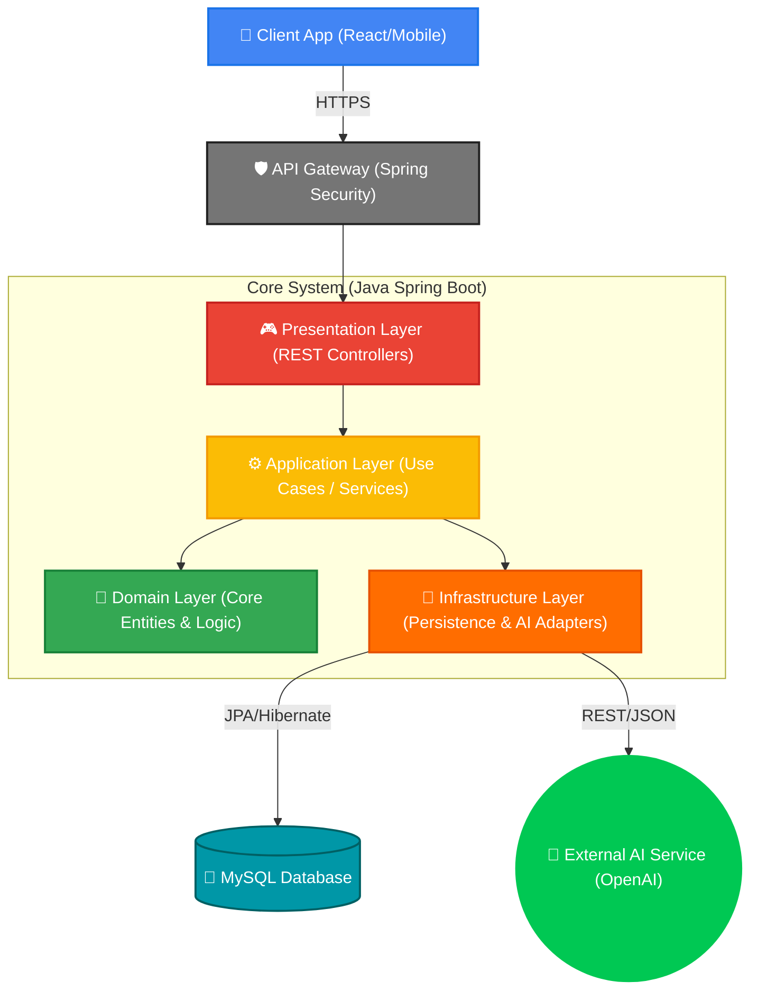
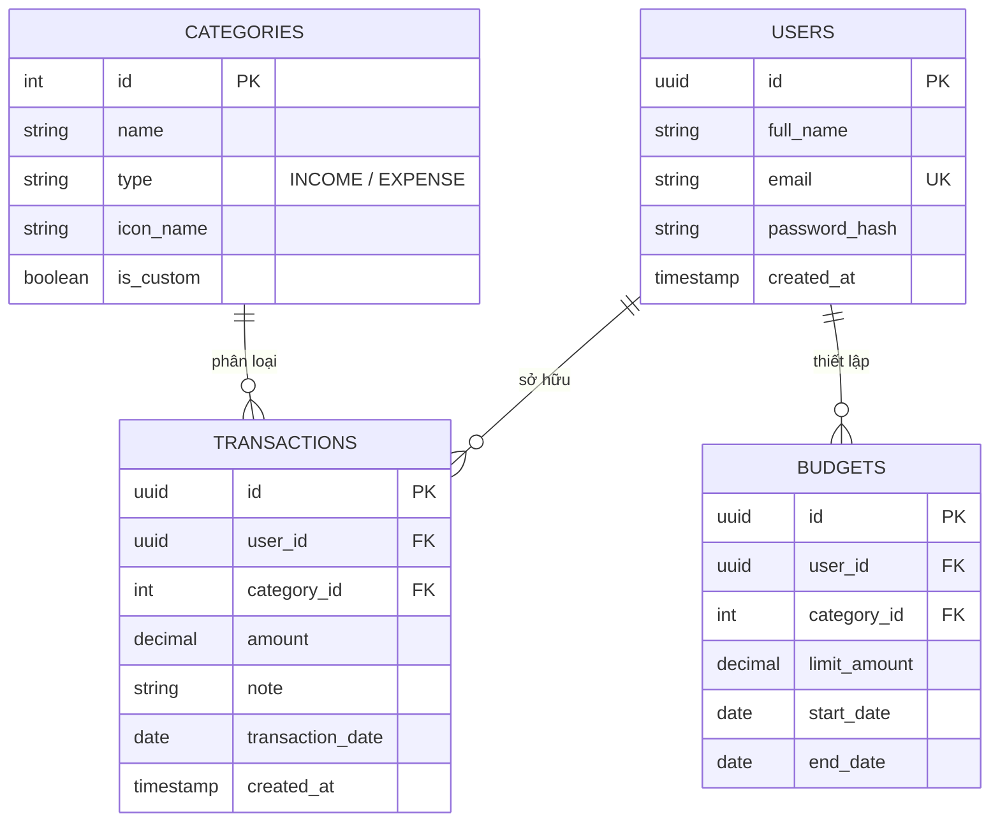
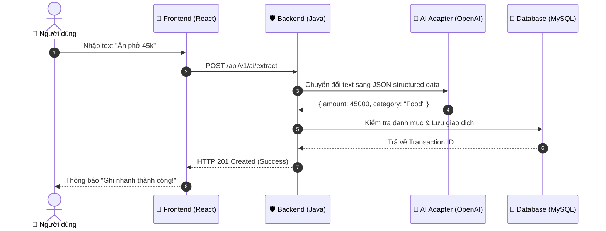
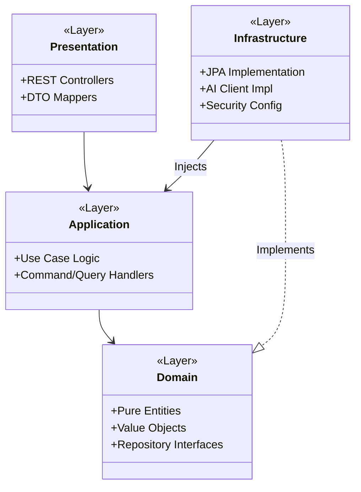

# 🏗️ System Design & Architectural Patterns

Tài liệu này trình bày kiến trúc chi tiết, sơ đồ thực thể và các luồng xử lý kỹ thuật của hệ thống **Smart Personal Finance**.

---

## 1. Kiến Trúc Tổng Thề (High-Level Architecture)

Hệ thống được thiết kế theo mô hình **Clean Architecture** kết hợp với **DDD (Domain-Driven Design)** sơ khai, đảm bảo tính độc lập giữa logic nghiệp vụ và các framework bên ngoài.

---

## 2. Thiết Kế Cơ Sở Dữ Liệu (ERD)

Cơ sở dữ liệu tập trung vào tính toàn vẹn và khả năng mở rộng cho các tính năng AI sau này.

---

## 3. Các Luồng Nghiệp Vụ Chính (Core Sequence)

### 3.1. Phân tích văn bản bằng AI (AI Extraction)

---

## 4. Phân Lớp Ứng Dụng (Clean Architecture Layers)

Mô hình chi tiết về sự phụ thuộc giữa các thành phần mã nguồn:

---
*Tài liệu này sẽ được cập nhật khi có thay đổi về kiến trúc microservices hoặc tích hợp LLM cục bộ.*

