<!--
  Báo cáo đồ án (Markdown)
  Nhóm 8 — Smart Personal Finance Management System
  Lưu ý: Tài liệu này được định dạng theo phong cách báo cáo học thuật.
-->

<div align="center">
  
**TRƯỜNG ĐẠI HỌC SÀI GÒN**

**KHOA CÔNG NGHỆ THÔNG TIN**

---

**ĐỒ ÁN CHUYÊN NGÀNH**

# Smart Personal Finance Management System
## (Hệ thống quản lý tài chính cá nhân thông minh tích hợp AI/NLP)

---

</div>

## Thông tin chung

| Mục | Nội dung |
|---|---|
| Môn học | Đồ án chuyên ngành |
| Giảng viên hướng dẫn | **PGS.TS. Nguyễn Tuấn Đăng** |
| Nhóm thực hiện | Nhóm 8 |
| Lớp | DCT122C2 |
| Học kỳ / Năm học | Học kỳ 2 / 2025–2026 |
| Ngày báo cáo | 11/05/2026 |

### Danh sách thành viên

| STT | Họ và tên | MSSV |
|---:|---|---|
| 1 | Phan Quốc An | 3122411001 |
| 2 | Nguyễn Xuân Tiến Đạt | 3122411040 |
| 3 | Lê Hồng Minh | 3122411124 |
| 4 | Vũ Tấn Phước | 3122411161 |

---

## Trang cam kết

Nhóm cam kết báo cáo này phản ánh trung thực quá trình nghiên cứu, thiết kế, triển khai và kiểm thử đồ án. Các nội dung trình bày trong báo cáo được xây dựng dựa trên sản phẩm do nhóm thực hiện, kết quả thực nghiệm và tài liệu tham khảo đã được liệt kê ở phần cuối báo cáo.

Đối với các thành phần có sử dụng AI/LLM/API trong hệ thống, nhóm trình bày rõ mục đích sử dụng, phạm vi tích hợp, cách xử lý đầu vào/đầu ra và các giới hạn liên quan. Nhóm chịu trách nhiệm về tính chính xác của nội dung báo cáo, mã nguồn và kết quả trình bày trong buổi bảo vệ.

> *Thành phố Hồ Chí Minh, ngày 11 tháng 05 năm 2026*  \
> *(Ký và ghi họ tên của các sinh viên)*

---

## MỤC LỤC

- [Trang cam kết](#trang-cam-kết)
- [Lời mở đầu](#lời-mở-đầu)
- [CHƯƠNG 1. TÓM TẮT ĐỒ ÁN](#chương-1-tóm-tắt-đồ-án)
- [CHƯƠNG 2. PHÁT BIỂU BÀI TOÁN VÀ MỤC TIÊU](#chương-2-phát-biểu-bài-toán-và-mục-tiêu)
  - [2.1. Bối cảnh và nhu cầu thực tế](#21-bối-cảnh-và-nhu-cầu-thực-tế)
  - [2.2. Mục tiêu chức năng](#22-mục-tiêu-chức-năng)
  - [2.3. Mục tiêu AI/NLP](#23-mục-tiêu-ainlp)
  - [2.4. Phạm vi đề tài](#24-phạm-vi-đề-tài)
- [CHƯƠNG 3. PHÂN TÍCH YÊU CẦU HỆ THỐNG](#chương-3-phân-tích-yêu-cầu-hệ-thống)
- [CHƯƠNG 4. THIẾT KẾ HỆ THỐNG](#chương-4-thiết-kế-hệ-thống)
  - [4.1. Sơ đồ kiến trúc tổng thể](#41-sơ-đồ-kiến-trúc-tổng-thể)
  - [4.2. Thiết kế cơ sở dữ liệu (ERD/schema)](#42-thiết-kế-cơ-sở-dữ-liệu-erdschema)
  - [4.3. Thiết kế API](#43-thiết-kế-api)
- [CHƯƠNG 5. CÔNG NGHỆ SỬ DỤNG](#chương-5-công-nghệ-sử-dụng)
- [CHƯƠNG 6. TÍCH HỢP TRÍ TUỆ NHÂN TẠO VÀ XỬ LÝ NGÔN NGỮ TỰ NHIÊN (AI/NLP)](#chương-6-tích-hợp-trí-tuệ-nhân-tạo-và-xử-lý-ngôn-ngữ-tự-nhiên-ainlp)
  - [6.1. NLP Parser: bóc tách giao dịch](#61-nlp-parser-bóc-tách-giao-dịch)
  - [6.2. Atelier AI: truy vấn lịch sử](#62-atelier-ai-truy-vấn-lịch-sử)
  - [6.3. OCR hóa đơn](#63-ocr-hóa-đơn)
- [CHƯƠNG 7. KẾT QUẢ THỰC NGHIỆM VÀ KIỂM THỬ](#chương-7-kết-quả-thực-nghiệm-và-kiểm-thử)
- [CHƯƠNG 8. ĐỐI SÁNH TRỰC TIẾP VỚI TIÊU CHÍ CHẤM ĐIỂM](#chương-8-đối-sánh-trực-tiếp-với-tiêu-chí-chấm-điểm)
- [Tài liệu tham khảo](#tài-liệu-tham-khảo)
- [Phụ lục](#phụ-lục)
  - [A. Thông tin dự án](#a-thông-tin-dự-án)
  - [B. Input mẫu cho AI/NLP](#b-input-mẫu-cho-ainlp)
  - [C. Ví dụ response AI/NLP](#c-ví-dụ-response-ainlp)
  - [D. Hướng dẫn chạy hệ thống](#d-hướng-dẫn-chạy-hệ-thống)
  - [E. Checklist rà soát trước khi nộp](#e-checklist-rà-soát-trước-khi-nộp)

---

# CHƯƠNG 1. TÓM TẮT ĐỒ ÁN

Đề tài "Xây dựng hệ thống quản lý tài chính cá nhân thông minh tích hợp AI/NLP" được thực hiện nhằm xây dựng một ứng dụng hỗ trợ người dùng theo dõi thu chi, quản lý ví tiền, phân loại giao dịch và khai thác lại dữ liệu tài chính cá nhân một cách thuận tiện hơn. Xuất phát từ thực tế người dùng thường gặp khó khăn trong việc duy trì thói quen ghi chép chi tiêu, nhóm tập trung thiết kế hệ thống theo hướng giảm thao tác thủ công và tăng khả năng tương tác tự nhiên với dữ liệu.

Hệ thống được tổ chức thành ba thành phần chính. Ứng dụng Mobile được phát triển bằng React Native/Expo, đóng vai trò là giao diện sử dụng trực tiếp của người dùng. Backend API được xây dựng bằng Spring Boot, đảm nhiệm các nghiệp vụ cốt lõi như xác thực, quản lý ví, giao dịch, danh mục và thống kê. AI Service được tách riêng bằng FastAPI để xử lý các chức năng liên quan đến NLP, OCR và sinh phản hồi thông minh.

Điểm nổi bật của đồ án nằm ở việc kết hợp các chức năng quản lý tài chính nền tảng với các thành phần AI/NLP có tính ứng dụng thực tế. Cụ thể, hệ thống hỗ trợ nhập giao dịch thủ công, quét hóa đơn để nhận diện thông tin như cửa hàng, ngày giao dịch, số tiền và gợi ý danh mục; đồng thời cung cấp Atelier AI cho phép người dùng truy vấn lịch sử chi tiêu bằng ngôn ngữ tự nhiên.

Trong quá trình triển khai, nhóm ưu tiên tính ổn định của hệ thống trong môi trường demo. Các chức năng AI được thiết kế theo hướng hỗ trợ người dùng thay vì tự động quyết định hoàn toàn. Đối với dữ liệu được nhận diện từ hóa đơn hoặc suy luận từ văn bản tự nhiên, hệ thống vẫn yêu cầu người dùng kiểm tra và chỉnh sửa trước khi lưu chính thức. Cách tiếp cận này giúp cân bằng giữa tính thông minh, độ tin cậy và khả năng kiểm soát dữ liệu tài chính cá nhân.

---

# CHƯƠNG 2. PHÁT BIỂU BÀI TOÁN VÀ MỤC TIÊU

## 2.1. Bối cảnh và nhu cầu thực tế

Quản lý tài chính cá nhân là một nhu cầu thiết thực đối với nhiều người, đặc biệt trong bối cảnh các hoạt động chi tiêu hằng ngày ngày càng đa dạng và diễn ra thường xuyên. Việc theo dõi thu nhập, chi tiêu, số dư ví tiền và các khoản ngân sách giúp người dùng có cái nhìn rõ hơn về tình hình tài chính của bản thân, từ đó đưa ra quyết định phù hợp trong việc kiểm soát chi tiêu và lập kế hoạch tài chính.

Tuy nhiên, trên thực tế, không phải người dùng nào cũng duy trì được thói quen ghi chép tài chính đều đặn. Một trong những nguyên nhân chính là quá trình nhập liệu còn mang tính thủ công, lặp lại và dễ gây gián đoạn trải nghiệm sử dụng. Với các khoản chi nhỏ nhưng phát sinh nhiều lần trong ngày như ăn uống, di chuyển, mua sắm hoặc thanh toán dịch vụ, người dùng thường có xu hướng bỏ qua việc ghi nhận. Điều này làm cho dữ liệu tài chính cá nhân trở nên thiếu đầy đủ, từ đó ảnh hưởng đến độ chính xác của các thống kê và phân tích sau này.

Bên cạnh khó khăn trong khâu nhập liệu, việc khai thác lại dữ liệu tài chính cũng là một vấn đề đáng quan tâm. Khi muốn trả lời các câu hỏi như *"tuần này đã chi bao nhiêu?"*, *"tháng trước danh mục nào tốn nhiều nhất?"* hoặc *"khoản chi nào xuất hiện thường xuyên?"*, người dùng thường phải lọc dữ liệu theo thời gian, nhóm theo danh mục và tự tổng hợp kết quả. Các thao tác này có thể không quá phức tạp về mặt kỹ thuật, nhưng lại gây bất tiện đối với người dùng phổ thông, đặc biệt khi dữ liệu giao dịch ngày càng nhiều.

Từ những vấn đề trên, nhóm lựa chọn xây dựng hệ thống quản lý tài chính cá nhân thông minh có tích hợp AI/NLP. Hệ thống không chỉ đáp ứng các chức năng cơ bản của một ứng dụng quản lý thu chi, mà còn hướng đến việc giảm thao tác thủ công và hỗ trợ người dùng tương tác với dữ liệu tài chính theo cách tự nhiên hơn. Cụ thể, đề tài tập trung vào ba hướng hỗ trợ chính:

- Ứng dụng OCR để nhận diện thông tin từ hóa đơn, qua đó giảm thời gian nhập liệu giao dịch.

- Sử dụng NLP parser để bóc tách thông tin giao dịch từ câu mô tả bằng tiếng Việt tự nhiên.

- Xây dựng Atelier AI nhằm hỗ trợ người dùng truy vấn lịch sử chi tiêu thông qua hội thoại, dựa trên dữ liệu giao dịch thực tế đã được lưu trong hệ thống.

Như vậy, bài toán đặt ra không chỉ là xây dựng một ứng dụng lưu trữ giao dịch tài chính, mà còn là thiết kế một hệ thống có khả năng hỗ trợ người dùng trong toàn bộ quá trình: ghi nhận dữ liệu, phân loại giao dịch, xem thống kê và khai thác lại thông tin tài chính bằng ngôn ngữ tự nhiên.

## 2.2. Mục tiêu chức năng

Mục tiêu tổng quát của đề tài là xây dựng một hệ thống quản lý tài chính cá nhân có tính ứng dụng thực tế, hoạt động ổn định trong môi trường demo và có tích hợp các thành phần AI/NLP nhằm cải thiện trải nghiệm nhập liệu cũng như truy vấn thông tin của người dùng.

Về mặt chức năng nền tảng, hệ thống cần đáp ứng các nghiệp vụ cơ bản của một ứng dụng quản lý tài chính cá nhân, bao gồm:

- Cho phép người dùng đăng ký, đăng nhập và sử dụng hệ thống với cơ chế xác thực phù hợp.

- Hỗ trợ quản lý ví tiền và số dư tương ứng.

- Cho phép tạo, chỉnh sửa, xóa và xem lịch sử giao dịch thu chi.

- Hỗ trợ phân loại giao dịch theo danh mục để phục vụ thống kê.

- Cung cấp màn hình tổng quan, thống kê và theo dõi ngân sách nhằm giúp người dùng nắm bắt tình hình tài chính cá nhân.

## 2.3. Mục tiêu AI/NLP

Bên cạnh các chức năng cơ bản, đề tài đặt mục tiêu tích hợp các thành phần thông minh để giảm thao tác thủ công và tăng khả năng khai thác dữ liệu. Các mục tiêu AI/NLP chính bao gồm:

- OCR hóa đơn: nhận diện thông tin từ ảnh hóa đơn hoặc biên lai, từ đó gợi ý các trường dữ liệu như cửa hàng, ngày giao dịch, số tiền và danh mục phù hợp.
- NLP parser: bóc tách thông tin giao dịch từ câu nhập tự nhiên bằng tiếng Việt, ví dụ như *"ăn phở 50k"* hoặc *"nhận lương 12 triệu"*.
- Atelier AI: cho phép người dùng đặt câu hỏi về lịch sử chi tiêu bằng ngôn ngữ tự nhiên và nhận phản hồi dựa trên dữ liệu giao dịch thật trong hệ thống.

Một mục tiêu quan trọng khác của đề tài là đảm bảo tính ổn định khi trình bày và chạy thử hệ thống. Do các thành phần AI có thể phụ thuộc vào tài nguyên máy, mô hình học máy hoặc chất lượng dữ liệu đầu vào, nhóm thiết kế hệ thống theo hướng kết hợp giữa mô hình học máy, luật xử lý, biểu thức chính quy và cơ chế fallback. Cách tiếp cận này giúp hệ thống vẫn có thể phản hồi hợp lý trong các trường hợp như mô hình chưa được tải hoàn tất, môi trường chạy thiếu tài nguyên hoặc dữ liệu đầu vào chưa đủ rõ ràng.

Thông qua các mục tiêu trên, đề tài hướng đến việc xây dựng một sản phẩm không chỉ có đầy đủ chức năng quản lý tài chính cơ bản, mà còn thể hiện được khả năng ứng dụng AI vào một bài toán thực tế, có giới hạn rõ ràng và phù hợp với phạm vi của đồ án chuyên ngành.

## 2.4. Phạm vi đề tài

Trong phạm vi đồ án, hệ thống được xây dựng theo mô hình gồm nhiều thành phần phối hợp với nhau. Các thành phần chính bao gồm:

- Ứng dụng Mobile được phát triển bằng React Native/Expo, đóng vai trò là giao diện tương tác chính của người dùng.

- Backend API được xây dựng bằng Spring Boot, chịu trách nhiệm xử lý nghiệp vụ, xác thực người dùng, quản lý dữ liệu tài chính và điều phối các yêu cầu đến AI Service.

- AI Service được xây dựng bằng FastAPI, đảm nhiệm các chức năng liên quan đến NLP, OCR và sinh phản hồi thông minh.

- Cơ sở dữ liệu MySQL 8 dùng để lưu trữ thông tin người dùng, ví tiền, danh mục, giao dịch, hóa đơn và các dữ liệu liên quan.

- Môi trường demo bằng Docker Compose nhằm hỗ trợ việc khởi chạy các service cần thiết một cách thống nhất trong quá trình kiểm thử và trình bày.

Hệ thống tập trung vào các luồng nghiệp vụ phục vụ quản lý tài chính cá nhân ở mức ứng dụng demo hoàn chỉnh, bao gồm quản lý tài khoản, ví tiền, giao dịch, danh mục, thống kê, quét hóa đơn và hỏi đáp lịch sử chi tiêu. Các chức năng AI được thiết kế theo hướng hỗ trợ người dùng, không tự động thay thế hoàn toàn quyết định của người dùng. Đối với những dữ liệu được nhận diện từ hóa đơn hoặc suy luận từ mô tả tự nhiên, hệ thống vẫn ưu tiên cơ chế kiểm tra và chỉnh sửa trước khi lưu chính thức.

Bên cạnh đó, đề tài cũng xác định một số nội dung nằm ngoài phạm vi triển khai. Cụ thể, hệ thống chưa tích hợp trực tiếp với ngân hàng hoặc ví điện tử thật, chưa triển khai đầy đủ trên môi trường production cloud và chưa thực hiện đánh giá mô hình AI trên tập dữ liệu lớn ở quy mô thực tế. Những nội dung này được xem là hướng mở rộng trong tương lai khi hệ thống có điều kiện tiếp cận dữ liệu lớn hơn, yêu cầu bảo mật cao hơn và môi trường vận hành thực tế hơn.

---

# CHƯƠNG 3. PHÂN TÍCH YÊU CẦU HỆ THỐNG

## 3.1. Phân tích yêu cầu chức năng

Hệ thống được xây dựng nhằm đáp ứng các yêu cầu tối thiểu của đề tài quản lý tài chính cá nhân. Trong phần này, nhóm đối chiếu trực tiếp các yêu cầu bắt buộc của đề bài với cách triển khai trong hệ thống và các minh chứng tương ứng.

### 3.1.1. Đối sánh yêu cầu bắt buộc

| STT | Yêu cầu bắt buộc | Mô tả cách nhóm thực hiện | Đã hoàn thành | Minh chứng |
|---:|---|---|---|---|
| 1 | Quản lý thu chi cá nhân | Hệ thống cho phép người dùng tạo, chỉnh sửa, xóa và xem danh sách giao dịch thu/chi thông qua nhóm API `/api/v1/transactions`. Trên mobile, người dùng có thể nhập giao dịch thủ công và theo dõi lịch sử giao dịch. | Có | `TransactionController.java`, `ManualTransactionModal.tsx` |
| 2 | Phân loại giao dịch theo danh mục | Mỗi giao dịch được gắn với một danh mục cụ thể. Người dùng có thể chọn danh mục thủ công; ngoài ra hệ thống AI/OCR có thể gợi ý danh mục dựa trên nội dung giao dịch hoặc hóa đơn. | Có | `Category.java`, `OcrAsyncService.java`, `ReceiptReviewForm.tsx` |
| 3 | Thống kê trực quan | Dashboard và analytics hiển thị dữ liệu tài chính theo thời gian, theo ví và theo danh mục, giúp người dùng theo dõi tổng quan tình hình thu chi. | Có | `DashboardScreen.tsx`, `AnalyticsScreen.tsx` |
| 4 | Tính toán số dư | Mỗi ví lưu số dư hiện tại và được cập nhật dựa trên các giao dịch thu/chi. Dashboard hiển thị tổng thu, tổng chi và số dư tổng quan từ dữ liệu hiện có. | Có | `WalletController.java`, `DashboardScreen.tsx` |
| 5 | Hệ thống xác thực người dùng | Hệ thống hỗ trợ đăng ký, đăng nhập và làm mới phiên đăng nhập bằng JWT access token/refresh token. Phía mobile có cơ chế refresh token với mutex để tránh lỗi khi nhiều request hết hạn cùng lúc. | Có | `AuthenticationController.java`, `api.ts`, `useAppStore.ts` |

## 3.2. Yêu cầu phi chức năng

Bên cạnh các yêu cầu chức năng, hệ thống cần đảm bảo các thuộc tính phi chức năng để đáp ứng tiêu chí đánh giá đồ án và khả năng chạy demo ổn định. Nhóm xác định một số yêu cầu phi chức năng quan trọng như sau:

- Hiệu năng: Danh sách giao dịch được phân trang để tránh tải dữ liệu quá lớn trong một lần gọi. Luồng OCR được triển khai bất đồng bộ; backend trả về `202 Accepted` kèm `receiptId`, sau đó mobile thực hiện polling để lấy kết quả, qua đó giảm nguy cơ timeout khi xử lý ảnh.

- Bảo mật: Hệ thống không cho phép client cung cấp trực tiếp `userId` trong các nghiệp vụ nhạy cảm; danh tính người dùng được xác định từ security context sau khi xác thực. Ngoài ra, cơ chế refresh token trên mobile sử dụng mutex nhằm hạn chế lỗi cạnh tranh (race condition) khi nhiều request đồng thời hết hạn access token.

- Tính ổn định: AI Service được thiết kế có cơ chế fallback, đảm bảo vẫn phản hồi hợp lý trong điều kiện thiếu tài nguyên hoặc mô hình chưa sẵn sàng, ví dụ như ưu tiên xử lý rule-based khi mô hình học máy không khả dụng.

- Khả năng mở rộng: Backend và AI Service được tách thành hai dịch vụ độc lập, giao tiếp qua HTTP nội bộ. Cấu hình hệ thống được đặt qua biến môi trường và có thể khởi chạy theo một cấu hình demo thống nhất bằng Docker Compose.

Các yêu cầu phi chức năng trên được lựa chọn theo định hướng tối ưu cho vận hành demo nhưng vẫn đảm bảo các nguyên tắc nền tảng về hiệu năng, bảo mật và khả năng mở rộng của hệ thống.

# CHƯƠNG 4. THIẾT KẾ HỆ THỐNG

## 4.1. Sơ đồ kiến trúc tổng thể

### Mô hình tổng quan

Hệ thống được tổ chức theo kiến trúc nhiều tầng, trong đó mobile đóng vai trò client, backend là trung tâm xử lý nghiệp vụ và quản lý dữ liệu, và AI Service cung cấp các năng lực NLP/OCR. Kiến trúc tổng quan được mô tả như sau:

```text
React Native / Expo Mobile App
        |
        | REST API + JWT
        v
Spring Boot Backend API  ------>  MySQL Database
        |
        | Internal HTTP Client
        v
FastAPI AI Service
```

Từ mô hình trên, nhóm tuân thủ các nguyên tắc thiết kế chính:

- Mobile không tương tác trực tiếp với cơ sở dữ liệu hoặc mô hình AI; mọi yêu cầu đều thông qua backend.

- Backend giữ vai trò điều phối: xác thực người dùng, kiểm tra dữ liệu, áp dụng nghiệp vụ và quyết định dữ liệu nào cần gửi sang AI Service.

- AI Service chỉ xử lý phần thông minh theo hợp đồng dữ liệu (schema) thống nhất; kết quả trả về được backend tiếp tục kiểm tra, lưu trữ và phản hồi cho mobile.

### Sơ đồ minh họa

> Hình 2.1 — Sơ đồ kiến trúc tổng thể
>
> 

## 4.2. Thiết kế cơ sở dữ liệu (ERD/schema)

Cơ sở dữ liệu được thiết kế theo mô hình quan hệ nhằm quản lý các thực thể cốt lõi của bài toán tài chính cá nhân. Trong đó, Transaction là thực thể trung tâm, liên kết với User, Wallet và Category. Ngoài ra, hệ thống bổ sung các thực thể phục vụ luồng OCR và cá nhân hóa gợi ý danh mục.

Các thực thể chính bao gồm: User, Wallet, Category, Transaction, Receipt, MerchantPreference, Budget.

- Transaction: lưu thông tin giao dịch thu/chi và là nguồn dữ liệu đầu vào cho thống kê và truy vấn lịch sử.

- Receipt: lưu dữ liệu trung gian của luồng OCR (ảnh hóa đơn, trạng thái xử lý, dữ liệu trích xuất), và chỉ tạo transaction sau khi người dùng xác nhận.

- MerchantPreference: lưu thói quen phân loại theo cửa hàng/merchant của từng người dùng, giúp cải thiện chất lượng gợi ý danh mục theo ngữ cảnh cá nhân.

### Bảng mô tả thực thể

| Entity | Vai trò | Quan hệ chính |
|---|---|---|
| User | Thông tin tài khoản người dùng | 1 user có nhiều wallet/receipt/preference |
| Wallet | Ví tiền và số dư | 1 wallet có nhiều transaction |
| Category | Danh mục thu/chi | Transaction tham chiếu; có thể map AI qua `nlpLabel` |
| Transaction | Giao dịch tài chính | Thuộc 1 wallet và 1 category |
| Receipt | Biên lai OCR | Có thể confirm để tạo transaction |
| MerchantPreference | Ghi nhớ phân loại theo merchant | Gắn với user + merchant + category |
| Budget | Ngân sách | Gắn với ví hoặc danh mục theo thời gian |

### ERD logic rút gọn

> Hình 2.2 — Sơ đồ ERD logic
>
> 

## 4.3. Thiết kế luồng người dùng và use case tổng quát

Từ yêu cầu bài toán và phạm vi đồ án, nhóm xác định các use case chính của hệ thống theo trình tự tương tác phổ biến của người dùng. Các use case trọng tâm gồm:

- Đăng ký/đăng nhập

- Quản lý ví

- Tạo giao dịch (thủ công)

- Xem dashboard/analytics

- Quét hóa đơn → review → confirm

- Hỏi Atelier AI

- Theo dõi ngân sách

Các use case trên đảm bảo vừa bao phủ nghiệp vụ nền tảng (quản lý thu chi), vừa thể hiện rõ điểm nhấn tích hợp AI/NLP/---

# CHƯƠNG 5. CÔNG NGHỆ SỬ DỤNG

Chương này trình bày các công nghệ được sử dụng trong quá trình xây dựng hệ thống, đồng thời mô tả cách cài đặt và triển khai môi trường demo. Việc lựa chọn công nghệ được định hướng bởi ba tiêu chí chính: phù hợp với phạm vi đồ án, hỗ trợ phát triển nhanh nhưng vẫn đủ khả năng mở rộng, và đảm bảo hệ thống có thể vận hành ổn định khi trình bày.

## 5.1. Công nghệ sử dụng

Hệ thống được triển khai theo mô hình nhiều thành phần, gồm ứng dụng mobile, backend API, AI Service và cơ sở dữ liệu. Để phù hợp với yêu cầu báo cáo theo template, nhóm tóm lược công nghệ theo ba tầng chính như sau.

| Thành phần | Công nghệ | Lý do chọn |
|---|---|---|
| Frontend | React Native (Expo), NativeWind | Phát triển đa nền tảng nhanh, giao diện nhất quán, phù hợp mục tiêu demo và mở rộng |
| Backend | Spring Boot, JPA/Hibernate, MySQL | Tách lớp nghiệp vụ rõ ràng, hỗ trợ xây dựng REST API và bảo mật, phù hợp dữ liệu quan hệ |
| AI/NLP/OCR | FastAPI, PaddleOCR, ViT5 correction (tùy chọn LLM) | Dễ triển khai dịch vụ AI, hỗ trợ OCR tiếng Việt và các chức năng NLP theo pipeline ổn định |

Nhóm tổ chức các thành phần chạy theo Docker Compose để đảm bảo môi trường demo có thể tái lập và đồng nhất giữa các máy.

## 5.2. Cài đặt và triển khai

Trong phạm vi đồ án, hệ thống được triển khai chủ yếu cho mục đích chạy thử và trình bày demo. Nhóm sử dụng Docker Compose để khởi chạy các thành phần phía server như cơ sở dữ liệu, backend API và AI Service theo một cấu hình thống nhất. Cách triển khai này giúp giảm rủi ro sai lệch môi trường giữa các máy phát triển và giúp quá trình chuẩn bị demo trở nên thuận tiện hơn.

Ứng dụng mobile được chạy thông qua Expo, cho phép kiểm thử trên Android emulator hoặc thiết bị thật. Backend đóng vai trò là điểm giao tiếp trung tâm giữa mobile, cơ sở dữ liệu và AI Service.

### 5.2.1. Cấu hình biến môi trường

Các thông tin cấu hình nhạy cảm hoặc phụ thuộc môi trường được đặt thông qua biến môi trường, thay vì hardcode trực tiếp trong mã nguồn. Cách làm này giúp hệ thống linh hoạt hơn khi thay đổi môi trường chạy, đồng thời hạn chế nguy cơ lộ thông tin nhạy cảm.

Bảng sau minh họa một số biến môi trường chính được sử dụng trong hệ thống. Các giá trị liên quan đến khóa bí mật hoặc API key chỉ được trình bày ở dạng đại diện, không đưa giá trị thật vào báo cáo hoặc mã nguồn.

| Service | Biến môi trường | Ý nghĩa | Ví dụ |
|---|---|---|---|
| Backend | `DB_URL` | JDBC URL kết nối đến MySQL | `jdbc:mysql://db:3306/...` |
| Backend | `JWT_SECRET` | Khóa dùng để ký JWT | `*` *(không commit)* |
| Backend | `NLP_SERVICE_URL` | URL nội bộ của AI Service | `http://ai:8000` |
| AI Service | `PHOBERT_MODEL_PATH` | Đường dẫn đến mô hình PhoBERT | `/models/phobert...` |
| AI Service | `GROQ_API_KEY` | API key dùng cho LLM tùy chọn | `*` *(không commit)* |

### 5.2.2. Quy trình chạy local cho demo

Quy trình chạy local được thiết kế theo hướng đơn giản, ưu tiên khả năng tái lập môi trường. Các bước cơ bản gồm cài đặt dependency, khởi động các service bằng Docker Compose và chạy ứng dụng mobile bằng Expo.

```bash
npm install

docker compose up -d

cd mobile

npm install

npm run start
```

Sau khi các service được khởi động, ứng dụng mobile có thể gọi backend API để thực hiện các chức năng như đăng nhập, quản lý giao dịch, upload hóa đơn và truy vấn Atelier AI.

### 5.2.3. Ghi chú môi trường chạy

Khi chạy trên Android emulator, địa chỉ gọi backend thường sử dụng `10.0.2.2:8080` để ánh xạ về máy host. Trong trường hợp chạy trên thiết bị thật, ứng dụng có thể gọi backend thông qua địa chỉ IP trong mạng LAN. Phía mobile có cơ chế hỗ trợ nhận diện địa chỉ từ Expo `hostUri` để giảm thao tác cấu hình thủ công khi demo.

Nhìn chung, quy trình cài đặt và triển khai hiện tại đáp ứng tốt mục tiêu của đồ án: dễ khởi chạy, dễ kiểm thử và phù hợp với môi trường trình bày. Đối với triển khai production trong tương lai, hệ thống cần bổ sung các thành phần như HTTPS, quản lý secret chuyên dụng, giám sát log/metric, cấu hình scale service và cơ chế backup dữ liệu.

---

# CHƯƠNG 6. TÍCH HỢP TRÍ TUỆ NHÂN TẠO VÀ XỬ LÝ NGÔN NGỮ TỰ NHIÊN (AI/NLP)

Chương này được tách riêng để trình bày các thành phần AI/NLP được tích hợp trong hệ thống. Theo yêu cầu của template báo cáo, mỗi tính năng AI/NLP được mô tả theo cùng một khung tiêu chí gồm: mục tiêu của tính năng, đầu vào và đầu ra, cách tiếp cận, mô hình hoặc dịch vụ sử dụng, pipeline xử lý, ví dụ minh họa, đánh giá chất lượng, chi phí và hiệu năng, hạn chế, và phần nhóm tự xây dựng.

Trong phạm vi đồ án, nhóm tập trung vào ba tính năng chính: NLP Parser để bóc tách giao dịch từ văn bản tự nhiên, Atelier AI để truy vấn lịch sử giao dịch bằng hội thoại, và OCR hóa đơn để nhận diện thông tin từ ảnh biên lai. Các tính năng này được thiết kế theo hướng hỗ trợ người dùng, không tự động thay thế hoàn toàn quyết định của người dùng, nhằm đảm bảo tính kiểm soát và độ tin cậy của dữ liệu tài chính cá nhân.

## 6.1. NLP Parser: bóc tách giao dịch từ văn bản

### 6.1.1. Bài toán và mục tiêu

Trong quá trình sử dụng ứng dụng quản lý tài chính cá nhân, người dùng thường có nhu cầu nhập nhanh giao dịch bằng một câu mô tả ngắn, ví dụ: *"ăn phở 50k"*, *"đổ xăng 70k hôm nay"* hoặc *"nhận lương 12 triệu"*. Nếu hệ thống có thể tự động trích xuất các trường dữ liệu quan trọng từ chuỗi văn bản này, thao tác nhập liệu sẽ được rút gọn đáng kể và giúp người dùng duy trì thói quen ghi nhận giao dịch thường xuyên hơn.

Mục tiêu của NLP Parser là trích xuất một bản nháp giao dịch (transaction draft) với các trường tối thiểu: số tiền, loại giao dịch (thu/chi), danh mục gợi ý và ghi chú, đồng thời cung cấp mức độ tin cậy để phục vụ quyết định xác nhận hoặc chỉnh sửa trước khi lưu.

### 6.1.2. Cách tiếp cận và lý do lựa chọn

Nhóm triển khai NLP Parser theo hướng hybrid pipeline, kết hợp giữa các phương pháp có tính quyết định (rule/regex) và mô hình học máy (tùy chọn), nhằm cân bằng giữa độ chính xác và tính ổn định.

- Regex/rule-based được ưu tiên ở bước trích xuất số tiền do đây là trường có tác động trực tiếp đến tính đúng đắn của giao dịch.
- PhoBERT fine-tuned (NER) được sử dụng khi mô hình sẵn sàng, nhằm hỗ trợ nhận diện thực thể và cải thiện khả năng hiểu ngữ cảnh trong tiếng Việt.
- Fallback được thiết kế để đảm bảo hệ thống vẫn hoạt động trong trường hợp mô hình không tải được hoặc môi trường thiếu tài nguyên.

Cách tiếp cận này phù hợp với mục tiêu đồ án: ưu tiên trải nghiệm sử dụng và độ ổn định demo, đồng thời vẫn thể hiện được thành phần AI/NLP một cách có kiểm soát.

### Bảng đối sánh tiêu chí AI/NLP – NLP Parser

| Tiêu chí bắt buộc | Nội dung triển khai trong dự án |
|---|---|
| 1. Mục tiêu | Trích xuất thông tin giao dịch từ câu tiếng Việt tự nhiên nhằm giảm thao tác nhập liệu thủ công |
| 2. Đầu vào / đầu ra | Đầu vào: câu mô tả (ví dụ: `Sáng nay ăn phở 50k`); đầu ra: JSON gồm `amount`, `type`, `category`, `date`, `note`, `confidence` |
| 3. Cách tiếp cận | Hybrid: regex/rule cho amount + PhoBERT NER (nếu khả dụng) + rule-based mapping danh mục |
| 4. Mô hình/dịch vụ sử dụng | PhoBERT fine-tuned NER (`phobert-finance-ner-final`) kết hợp rule/regex fallback |
| 5. Pipeline xử lý | Chuẩn hóa văn bản → trích xuất amount → (tùy chọn) chạy NER → gợi ý danh mục → suy luận income/expense → trả JSON |
| 6. Ví dụ minh họa | Input: `ăn phở 50k` → amount `50000`, type `EXPENSE`, category gợi ý `FOOD/Ăn uống`, confidence khoảng `0.8` |
| 7. Đánh giá chất lượng | Ưu tiên đúng amount và type; category được thiết kế theo hướng gợi ý, người dùng có thể chỉnh trước khi lưu |
| 8. Chi phí và hiệu năng | Rule/regex không phát sinh chi phí; mô hình chạy local phụ thuộc CPU/RAM; fallback giúp phản hồi nhanh khi model chưa sẵn sàng |
| 9. Hạn chế | Câu mơ hồ, từ lóng mới, hoặc nhiều giao dịch trong một input làm giảm độ chính xác |
| 10. Phần nhóm tự xây dựng | Chuẩn hóa văn bản, parser số tiền tiếng Việt, mapping danh mục và cơ chế fallback trong AI service và tích hợp backend |

> Hình 3.1 — Pipeline NLP Parser
>
> 

## 6.2. Atelier AI: truy vấn lịch sử giao dịch bằng hội thoại

### 6.2.1. Mục tiêu và yêu cầu thiết kế

Bên cạnh thao tác nhập liệu, một nhu cầu quan trọng khác của người dùng là khai thác lại dữ liệu tài chính theo cách nhanh và tự nhiên. Thay vì phải thực hiện nhiều bước lọc và tổng hợp, người dùng có thể đặt câu hỏi trực tiếp như: *"Tuần này tôi chi bao nhiêu?"* hoặc *"Tháng trước danh mục nào tốn nhiều nhất?"*. Để đáp ứng nhu cầu này, nhóm xây dựng Atelier AI – một thành phần hỏi đáp dựa trên lịch sử giao dịch.

Yêu cầu cốt lõi của Atelier AI là đảm bảo câu trả lời dựa trên dữ liệu thật của người dùng trong hệ thống và hạn chế hiện tượng suy diễn không có căn cứ (hallucination). Do đó, nhóm thiết kế theo hướng hybrid, trong đó backend đóng vai trò ràng buộc dữ liệu và xác định ngữ cảnh trước khi gửi sang AI Service.

### 6.2.2. Cách tiếp cận grounded và cơ chế kiểm soát

- Backend sử dụng `HistoryChatIntentHandler` để xác định ý định (intent), khoảng thời gian (time window) và tạo transaction slice rút gọn.

- AI Service có thể sử dụng LLM qua Groq khi bật cấu hình `GROQ_MODEL`; trong trường hợp không có khóa API hoặc không bật LLM, hệ thống sử dụng phương án tổng hợp có cấu trúc để trả lời.

- Phản hồi có thể kèm danh sách giao dịch liên quan (`matched_txn_ids`) nhằm phục vụ việc hiển thị minh chứng ở giao diện người dùng.

Thiết kế này giúp giảm dữ liệu gửi sang mô hình, cải thiện thời gian phản hồi và quan trọng hơn là tăng khả năng kiểm chứng của câu trả lời dựa trên dữ liệu đầu vào đã được ràng buộc.

### Bảng đối sánh tiêu chí AI/NLP – Atelier AI

| Tiêu chí bắt buộc | Nội dung triển khai trong dự án |
|---|---|
| 1. Mục tiêu | Trả lời câu hỏi tài chính dựa trên lịch sử giao dịch thật của người dùng |
| 2. Đầu vào / đầu ra | Đầu vào: câu hỏi + transaction slice rút gọn; đầu ra: `answer`, `summary`, và có thể kèm `matched_txn_ids` |
| 3. Cách tiếp cận | Hybrid: backend grounding + intent/time-window detection + AI answering |
| 4. Mô hình/dịch vụ sử dụng | LLM qua Groq (tùy cấu hình); fallback bằng logic tổng hợp có cấu trúc khi không bật LLM |
| 5. Pipeline xử lý | Nhận query → xác định intent/thời gian → cắt lát dữ liệu → gửi AI service → sinh câu trả lời → trả về mobile |
| 6. Ví dụ minh họa | `Tuần này tôi chi bao nhiêu?` → tổng tiền, số giao dịch, danh mục nổi bật; có thể kèm giao dịch liên quan |
| 7. Đánh giá chất lượng | Phụ thuộc chất lượng time window và dữ liệu đầu vào; grounded slice giúp giảm hallucination |
| 8. Chi phí và hiệu năng | Khi gọi Groq có chi phí; slice nhỏ giúp giảm thời gian phản hồi so với gửi toàn bộ lịch sử |
| 9. Hạn chế | Dữ liệu thiếu hoặc phân loại sai làm giảm độ chính xác; câu hỏi mơ hồ cần cơ chế hỏi lại/giải thích |
| 10. Phần nhóm tự xây dựng | Logic chọn time window, slicing, intent handling, contract giữa backend–AI service và UI hiển thị giao dịch liên quan |

## 6.3. OCR hóa đơn

### 6.3.1. Mục tiêu và bối cảnh áp dụng

Trong các tình huống chi tiêu tại cửa hàng, người dùng thường có hóa đơn/biên lai. Việc nhập thủ công số tiền và nội dung từ hóa đơn có thể gây tốn thời gian và dễ sai sót. Do đó, hệ thống tích hợp OCR nhằm trích xuất thông tin chính từ ảnh hóa đơn, qua đó tạo ra một bản nháp giao dịch để người dùng rà soát và xác nhận.

Một nguyên tắc quan trọng trong thiết kế là không tự động lưu giao dịch dựa trên OCR. Thay vào đó, hệ thống bắt buộc người dùng review và chỉnh sửa trước khi xác nhận, nhằm hạn chế rủi ro lưu sai dữ liệu do chất lượng ảnh hoặc sai số OCR.

### 6.3.2. Pipeline xử lý và cơ chế bất đồng bộ

OCR được triển khai theo pipeline nhiều bước nhằm cải thiện chất lượng nhận diện tiếng Việt và tăng độ ổn định:

- Tiền xử lý ảnh (upscale/grayscale/denoise/CLAHE/threshold...) để tăng khả năng đọc ký tự.
- PaddleOCR trích xuất văn bản từ ảnh.
- ViT5 correction hậu xử lý nhằm giảm lỗi chính tả/ký tự tiếng Việt.
- (Tùy chọn) LLM repair để chuẩn hóa dữ liệu khi bật cấu hình.

Do thời gian xử lý có thể kéo dài, luồng OCR được thiết kế bất đồng bộ (backend trả `202 Accepted` và mobile polling). Cách tiếp cận này giúp giảm nguy cơ timeout và đảm bảo trải nghiệm người dùng trong môi trường demo.

### Bảng đối sánh tiêu chí AI/NLP – OCR hóa đơn

| Tiêu chí bắt buộc | Nội dung triển khai trong dự án |
|---|---|
| 1. Mục tiêu | Nhận diện hóa đơn để gợi ý giao dịch (merchant/date/amount/category) và giảm nhập liệu |
| 2. Đầu vào / đầu ra | Đầu vào: ảnh hóa đơn; đầu ra: `store`, `date`, `amount`, `confidence`, `raw_text`, gợi ý `category` |
| 3. Cách tiếp cận | Hybrid pipeline nhiều bước (tiền xử lý ảnh + OCR + correction + mapping) |
| 4. Mô hình/dịch vụ sử dụng | PaddleOCR + ViT5 correction (`hoanghaiduong/vit5-correction`), tùy chọn LLM repair qua Groq |
| 5. Pipeline xử lý | Preprocess ảnh → PaddleOCR → chuẩn hóa/correction tiếng Việt → trích xuất trường dữ liệu → map category (MerchantPreference/label) |
| 6. Ví dụ minh họa | Ảnh hóa đơn → hệ thống trả amount/date/store; mobile hiển thị màn review để người dùng kiểm tra/chỉnh trước khi confirm |
| 7. Đánh giá chất lượng | Ưu tiên đúng amount/date; bắt buộc review trước khi tạo transaction để hạn chế sai dữ liệu |
| 8. Chi phí và hiệu năng | OCR/correction chạy local không cần API; LLM repair (nếu bật) phát sinh chi phí; thiết kế async (202 + polling) để tránh timeout |
| 9. Hạn chế | Ảnh mờ/lóa/góc nghiêng, hóa đơn nhiều cột hoặc font lạ làm giảm chất lượng OCR |
| 10. Phần nhóm tự xây dựng | Luồng OCR async (upload/poll/review/confirm), tiền xử lý ảnh, chuẩn hóa output, mapping danh mục theo merchant và fallback |

> Hình 3.2 — Pipeline OCR đa tầng
>
> 

## 6.3. OCR hóa đơn

### 3.3.1. Mục tiêu và bối cảnh áp dụng

Trong các tình huống chi tiêu tại cửa hàng, người dùng thường có hóa đơn/biên lai. Việc nhập thủ công số tiền và nội dung từ hóa đơn có thể gây tốn thời gian và dễ sai sót. Do đó, hệ thống tích hợp OCR nhằm trích xuất thông tin chính từ ảnh hóa đơn, qua đó tạo ra một bản nháp giao dịch để người dùng rà soát và xác nhận.

Một nguyên tắc quan trọng trong thiết kế là không tự động lưu giao dịch dựa trên OCR. Thay vào đó, hệ thống bắt buộc người dùng review và chỉnh sửa trước khi xác nhận, nhằm hạn chế rủi ro lưu sai dữ liệu do chất lượng ảnh hoặc sai số OCR.

### 3.3.2. Pipeline xử lý và cơ chế bất đồng bộ

OCR được triển khai theo pipeline nhiều bước nhằm cải thiện chất lượng nhận diện tiếng Việt và tăng độ ổn định:

- Tiền xử lý ảnh (upscale/grayscale/denoise/CLAHE/threshold...) để tăng khả năng đọc ký tự.
- PaddleOCR trích xuất văn bản từ ảnh.
- ViT5 correction hậu xử lý nhằm giảm lỗi chính tả/ký tự tiếng Việt.
- (Tùy chọn) LLM repair để chuẩn hóa dữ liệu khi bật cấu hình.

Do thời gian xử lý có thể kéo dài, luồng OCR được thiết kế bất đồng bộ (backend trả `202 Accepted` và mobile polling). Cách tiếp cận này giúp giảm nguy cơ timeout và đảm bảo trải nghiệm người dùng trong môi trường demo.

### Bảng đối sánh tiêu chí AI/NLP – OCR hóa đơn

| Tiêu chí bắt buộc | Nội dung triển khai trong dự án |
|---|---|
| 1. Mục tiêu | Nhận diện hóa đơn để gợi ý giao dịch (merchant/date/amount/category) và giảm nhập liệu |
| 2. Đầu vào / đầu ra | Đầu vào: ảnh hóa đơn; đầu ra: `store`, `date`, `amount`, `confidence`, `raw_text`, gợi ý `category` |
| 3. Cách tiếp cận | Hybrid pipeline nhiều bước (tiền xử lý ảnh + OCR + correction + mapping) |
| 4. Mô hình/dịch vụ sử dụng | PaddleOCR + ViT5 correction (`hoanghaiduong/vit5-correction`), tùy chọn LLM repair qua Groq |
| 5. Pipeline xử lý | Preprocess ảnh → PaddleOCR → chuẩn hóa/correction tiếng Việt → trích xuất trường dữ liệu → map category (MerchantPreference/label) |
| 6. Ví dụ minh họa | Ảnh hóa đơn → hệ thống trả amount/date/store; mobile hiển thị màn review để người dùng kiểm tra/chỉnh trước khi confirm |
| 7. Đánh giá chất lượng | Ưu tiên đúng amount/date; bắt buộc review trước khi tạo transaction để hạn chế sai dữ liệu |
| 8. Chi phí và hiệu năng | OCR/correction chạy local không cần API; LLM repair (nếu bật) phát sinh chi phí; thiết kế async (202 + polling) để tránh timeout |
| 9. Hạn chế | Ảnh mờ/lóa/góc nghiêng, hóa đơn nhiều cột hoặc font lạ làm giảm chất lượng OCR |
| 10. Phần nhóm tự xây dựng | Luồng OCR async (upload/poll/review/confirm), tiền xử lý ảnh, chuẩn hóa output, mapping danh mục theo merchant và fallback |

> Hình 3.2 — Pipeline OCR đa tầng
>
> 

---

# CHƯƠNG 5. CÔNG NGHỆ SỬ DỤNG

Chương này trình bày các công nghệ được sử dụng trong quá trình xây dựng hệ thống, đồng thời mô tả cách cài đặt và triển khai môi trường demo. Việc lựa chọn công nghệ được định hướng bởi ba tiêu chí chính: phù hợp với phạm vi đồ án, hỗ trợ phát triển nhanh nhưng vẫn đủ khả năng mở rộng, và đảm bảo hệ thống có thể vận hành ổn định khi trình bày.

## 4.1. Công nghệ sử dụng

Hệ thống được triển khai theo mô hình nhiều thành phần, gồm ứng dụng mobile, backend API, AI Service và cơ sở dữ liệu. Để phù hợp với yêu cầu báo cáo theo template, nhóm tóm lược công nghệ theo ba tầng chính như sau.

| Thành phần | Công nghệ | Lý do chọn |
|---|---|---|
| Frontend | React Native (Expo), NativeWind | Phát triển đa nền tảng nhanh, giao diện nhất quán, phù hợp mục tiêu demo và mở rộng |
| Backend | Spring Boot, JPA/Hibernate, MySQL | Tách lớp nghiệp vụ rõ ràng, hỗ trợ xây dựng REST API và bảo mật, phù hợp dữ liệu quan hệ |
| AI/NLP/OCR | FastAPI, PaddleOCR, ViT5 correction (tùy chọn LLM) | Dễ triển khai dịch vụ AI, hỗ trợ OCR tiếng Việt và các chức năng NLP theo pipeline ổn định |

Nhóm tổ chức các thành phần chạy theo Docker Compose để đảm bảo môi trường demo có thể tái lập và đồng nhất giữa các máy.
## 4.2. Cài đặt và triển khai

Trong phạm vi đồ án, hệ thống được triển khai chủ yếu cho mục đích chạy thử và trình bày demo. Nhóm sử dụng Docker Compose để khởi chạy các thành phần phía server như cơ sở dữ liệu, backend API và AI Service theo một cấu hình thống nhất. Cách triển khai này giúp giảm rủi ro sai lệch môi trường giữa các máy phát triển và giúp quá trình chuẩn bị demo trở nên thuận tiện hơn.

Ứng dụng mobile được chạy thông qua Expo, cho phép kiểm thử trên Android emulator hoặc thiết bị thật. Backend đóng vai trò là điểm giao tiếp trung tâm giữa mobile, cơ sở dữ liệu và AI Service.

### 4.2.1. Cấu hình biến môi trường

Các thông tin cấu hình nhạy cảm hoặc phụ thuộc môi trường được đặt thông qua biến môi trường, thay vì hardcode trực tiếp trong mã nguồn. Cách làm này giúp hệ thống linh hoạt hơn khi thay đổi môi trường chạy, đồng thời hạn chế nguy cơ lộ thông tin nhạy cảm.

Bảng sau minh họa một số biến môi trường chính được sử dụng trong hệ thống. Các giá trị liên quan đến khóa bí mật hoặc API key chỉ được trình bày ở dạng đại diện, không đưa giá trị thật vào báo cáo hoặc mã nguồn.

| Service | Biến môi trường | Ý nghĩa | Ví dụ |
|---|---|---|---|
| Backend | `DB_URL` | JDBC URL kết nối đến MySQL | `jdbc:mysql://db:3306/...` |
| Backend | `JWT_SECRET` | Khóa dùng để ký JWT | `*` *(không commit)* |
| Backend | `NLP_SERVICE_URL` | URL nội bộ của AI Service | `http://ai:8000` |
| AI Service | `PHOBERT_MODEL_PATH` | Đường dẫn đến mô hình PhoBERT | `/models/phobert...` |
| AI Service | `GROQ_API_KEY` | API key dùng cho LLM tùy chọn | `*` *(không commit)* |

### 4.2.2. Quy trình chạy local cho demo

Quy trình chạy local được thiết kế theo hướng đơn giản, ưu tiên khả năng tái lập môi trường. Các bước cơ bản gồm cài đặt dependency, khởi động các service bằng Docker Compose và chạy ứng dụng mobile bằng Expo.

```bash
npm install
docker compose up -d
cd mobile
npm install
npm run start
```

Sau khi các service được khởi động, ứng dụng mobile có thể gọi backend API để thực hiện các chức năng như đăng nhập, quản lý giao dịch, upload hóa đơn và truy vấn Atelier AI.

### 4.2.3. Ghi chú môi trường chạy

Khi chạy trên Android emulator, địa chỉ gọi backend thường sử dụng `10.0.2.2:8080` để ánh xạ về máy host. Trong trường hợp chạy trên thiết bị thật, ứng dụng có thể gọi backend thông qua địa chỉ IP trong mạng LAN. Phía mobile có cơ chế hỗ trợ nhận diện địa chỉ từ Expo `hostUri` để giảm thao tác cấu hình thủ công khi demo.

Nhìn chung, quy trình cài đặt và triển khai hiện tại đáp ứng tốt mục tiêu của đồ án: dễ khởi chạy, dễ kiểm thử và phù hợp với môi trường trình bày. Đối với triển khai production trong tương lai, hệ thống cần bổ sung các thành phần như HTTPS, quản lý secret chuyên dụng, giám sát log/metric, cấu hình scale service và cơ chế backup dữ liệu.

---

# CHƯƠNG 7. KẾT QUẢ THỰC NGHIỆM VÀ KIỂM THỬ

Chương này trình bày quá trình kiểm thử hệ thống nhằm đánh giá mức độ hoàn thiện của các chức năng, hiệu năng vận hành và các yếu tố an toàn bảo mật cơ bản. Nhóm triển khai chiến lược kiểm thử theo nhiều tầng, bao gồm kiểm thử đơn vị (unit test), kiểm thử tích hợp (integration test) và kiểm thử luồng cuối (E2E test), từ đó xác minh hệ thống hoạt động đúng theo thiết kế đã trình bày ở các chương trước.

## 7.1. Tổng quan kết quả kiểm thử

Hệ thống được đánh giá trên ba thành phần chính: Backend (Spring Boot), Frontend (React Native/Expo) và AI Service (FastAPI). Kết quả tổng hợp cho thấy hệ thống đạt độ ổn định tốt trong phạm vi kiểm thử của đồ án.

- Tổng số kịch bản kiểm thử: 110
- Tỷ lệ vượt qua: 110/110 (100%)

| Tầng | Số lượng test | Kết quả | Thời gian thực thi | Coverage |
|---|---:|---|---:|---:|
| Backend (JUnit) | 59 | 59/59 pass | ~15s | 78% |

| Frontend (Jest) | 17 | 17/17 pass | 8.5s | 70% |

| AI Service (pytest) | 34 | 34/34 pass | ~30s | 77% |

| Tổng | 110 | 110/110 pass | ~53s | 75% |

Nhận xét: Độ bao phủ mã nguồn tổng thể đạt 75%, tiệm cận mục tiêu 80%. Các module cốt lõi như xác thực, quản lý giao dịch, luồng OCR bất đồng bộ và bộ xử lý ý định NLP đều đạt coverage trên 75%, giúp tăng độ tin cậy cho các luồng nghiệp vụ chính.

## 7.2. Kiểm thử chức năng

Nhóm thực hiện kiểm thử chức năng nhằm xác minh các yêu cầu nghiệp vụ đã phân tích ở Chương 2. Các kịch bản kiểm thử tập trung vào những luồng sử dụng quan trọng nhất của hệ thống, bao gồm xác thực, quản lý ví, quản lý giao dịch, thống kê, OCR hóa đơn và Atelier AI.

| STT | Chức năng | Test case | Kết quả mong đợi | Kết quả thực tế | Đạt/Không đạt |
|---:|---|---|---|---|---|
| 1 | Xác thực | Đăng nhập với email/password hợp lệ | Trả về access token và refresh token | Trả token thành công; mobile lưu trữ an toàn qua SecureStore | Đạt |
| 2 | Xác thực | Truy cập API khi access token hết hạn | Hệ thống tự động refresh token và thử lại request | Refresh token vận hành qua mutex, request tiếp tục thành công | Đạt |
| 3 | Quản lý ví | Tạo ví mới với tên và số dư ban đầu | Ví được lưu và hiển thị trong danh sách | API tạo ví thành công; dashboard cập nhật tổng số dư | Đạt |
| 4 | Quản lý thu chi | Tạo giao dịch chi tiêu thủ công | Giao dịch được ghi nhận, gắn đúng ví/danh mục và cập nhật số dư | Giao dịch xuất hiện trong lịch sử, số dư thay đổi đúng | Đạt |
| 5 | Phân loại giao dịch | Lựa chọn danh mục khi tạo giao dịch | Giao dịch được gắn với danh mục đã chọn | Backend trả về định danh danh mục đúng với lựa chọn | Đạt |
| 6 | Thống kê | Truy cập dashboard/analytics khi có dữ liệu | Hiển thị tổng thu, tổng chi và biểu đồ/tổng hợp | Dữ liệu tổng hợp hiển thị đúng theo dữ liệu giao dịch | Đạt |
| 7 | OCR hóa đơn | Tải lên ảnh hóa đơn hợp lệ | Backend trả `202 Accepted` và `receiptId` | Mobile nhận receiptId và chuyển sang polling | Đạt |
| 8 | OCR review | Xác nhận receipt sau khi xử lý hoàn tất | Tạo transaction từ dữ liệu hóa đơn đã review | Transaction được tạo sau xác nhận của người dùng | Đạt |
| 9 | Atelier AI | Truy vấn lịch sử chi tiêu qua hội thoại | Trả lời dựa trên transaction slice | Mobile hiển thị câu trả lời và các giao dịch liên quan | Đạt |
| 10 | E2E smoke | Thực hiện luồng login → tạo giao dịch → chat | Các bước vận hành liên tục, không phát sinh lỗi | Kịch bản Maestro hoàn thành thành công | Đạt |

## 7.3. Kiểm thử thành phần AI/NLP

Do các chức năng AI/NLP có đặc thù phụ thuộc vào chất lượng dữ liệu đầu vào và ngữ cảnh xử lý, nhóm xây dựng bộ kiểm thử riêng để đánh giá khả năng bóc tách thông tin, hiểu ý định người dùng và xử lý các trường hợp đầu vào chưa đầy đủ.

| STT | Chức năng AI/NLP | Test case | Kết quả mong đợi | Kết quả thực tế | Đạt/Không đạt |
|---:|---|---|---|---|---|
| 1 | NLP Parser | Input `ăn phở 50k` | Parse amount `50000`, type `EXPENSE`, category ăn uống/food | Trả amount/type/category với confidence hợp lệ | Đạt |
| 2 | NLP Parser | Input `nhận lương 12 triệu` | Parse amount `12000000`, type `INCOME` | Trả income transaction draft | Đạt |
| 3 | NLP Parser | Input thiếu số tiền | Không tạo giao dịch chắc chắn; trả confidence thấp hoặc yêu cầu bổ sung | Hệ thống fallback, không tự lưu giao dịch sai | Đạt |
| 4 | Atelier AI | Query `Tuần này tôi chi bao nhiêu?` | Xác định time window tuần hiện tại và tổng hợp chi tiêu | Trả tổng tiền, số giao dịch và danh mục nổi bật | Đạt |
| 5 | Atelier AI | Query `Tháng trước danh mục nào tốn nhiều nhất?` | Cắt dữ liệu tháng trước và tìm category lớn nhất | Trả summary dựa trên transaction slice | Đạt |
| 6 | OCR | Upload ảnh hóa đơn rõ | Trích xuất được store/date/amount/raw_text | Receipt được xử lý và hiển thị màn review | Đạt |
| 7 | OCR | Ảnh hóa đơn mờ hoặc thiếu thông tin | Không tạo transaction tự động; user phải review/chỉnh | Hệ thống hiển thị confidence và cho sửa trước confirm | Đạt |
| 8 | OCR category mapping | Merchant đã có preference | Ưu tiên category theo MerchantPreference | Category gợi ý theo merchant trước AI label | Đạt |

## 7.4. Kiểm thử Backend (Spring Boot)

### 7.4.1. Kiểm thử nghiệp vụ CRUD

Backend có 59 kịch bản kiểm thử sử dụng JUnit 5 và Spring Boot Test. Các kịch bản này bao phủ những vùng nghiệp vụ chính của hệ thống:

- Authentication & Authorization (12)

- Transaction CRUD (18)

- Wallet Management (8)

- Category Management (6)

- OCR Async Workflow (10)

- Atelier AI Integration (5)

Ví dụ kịch bản kiểm thử:

```java
@Test
void testCreateTransaction_Success() {
    // Arrange
    TransactionRequest request = new TransactionRequest(
        "EXPENSE", 50000.0, "Mua cafe", walletId, categoryId
    );

    // Act
    ResponseEntity<TransactionResponse> response =
        transactionController.createTransaction(request, userId);

    // Assert
    assertEquals(HttpStatus.CREATED, response.getStatusCode());
    assertNotNull(response.getBody().getId());
    assertEquals(50000.0, response.getBody().getAmount());
}
```

Kết quả thực thi:

```text
[INFO] Tests run: 59, Failures: 0, Errors: 0, Skipped: 0
[INFO] BUILD SUCCESS
[INFO] Total time: 15.234 s
```

### 7.4.2. Kiểm thử OCR Async Workflow

Để xác minh tính đúng đắn của luồng xử lý bất đồng bộ, nhóm kiểm thử theo chu trình trạng thái của thực thể `Receipt`:

1. Upload thành công → Receipt status `PENDING`.
2. Polling → `PROCESSING` → `PROCESSED`.
3. OCR thất bại → status `FAILED` và trả thông báo lỗi.
4. Confirm receipt → tạo transaction từ dữ liệu đã được người dùng rà soát.

Log minh họa:

```text
2026-05-09 04:25:12 INFO  OcrAsyncServiceTest - Upload receipt: receiptId=abc123
2026-05-09 04:25:13 INFO  OcrAsyncServiceTest - Poll status: PROCESSING
2026-05-09 04:25:15 INFO  OcrAsyncServiceTest - Poll status: PROCESSED
2026-05-09 04:25:16 INFO  OcrAsyncServiceTest - Confirm receipt: transactionId=tx456
```

## 7.5. Kiểm thử Frontend (React Native/Expo)

### 7.5.1. Kiểm thử Component và Hook

Frontend có 17 kịch bản kiểm thử sử dụng Jest và React Native Testing Library. Nội dung kiểm thử tập trung vào tính đúng đắn của giao diện, thao tác nhập liệu và logic xử lý trạng thái phía client:

- Authentication screens (4)

- Transaction components (6)

- Receipt scanner (3)

- Atelier AI UI (2)

- Custom hooks (2)

Ví dụ kịch bản kiểm thử:

```typescript
test('ManualTransactionModal submits transaction', async () => {
  const onSubmit = jest.fn();
  render(<ManualTransactionModal visible={true} onSubmit={onSubmit} />);

  fireEvent.changeText(screen.getByPlaceholderText('Số tiền'), '50000');
  fireEvent.press(screen.getByText('Lưu'));

  await waitFor(() => {
    expect(onSubmit).toHaveBeenCalledWith(
      expect.objectContaining({ amount: 50000 })
    );
  });
});
```

### 7.5.2. Kiểm thử E2E với Maestro

Nhóm xây dựng smoke test E2E cho các luồng nghiệp vụ ưu tiên (P0), nhằm đảm bảo toàn bộ chuỗi tương tác từ giao diện đến backend và AI Service vận hành liên tục.

1. Đăng nhập.
2. Tạo giao dịch thủ công.
3. Quét hóa đơn (poll → review → confirm).
4. Atelier AI (gửi query → nhận response).

Log minh họa:

```text
✓ Open app (1.2s)
✓ Login with test credentials (2.3s)
✓ Navigate to Transactions tab (0.8s)
✓ Create manual transaction (3.1s)
✓ Open Atelier AI (1.5s)
✓ Send query "Tuần này tôi chi bao nhiêu?" (4.2s)

All flows passed in 13.1s
```

## 7.6. Kiểm thử AI Service (FastAPI)

AI Service có 34 kịch bản kiểm thử sử dụng pytest. Các test case tập trung vào độ chính xác của các thành phần trích xuất thông tin, phân loại ý định và mapping dữ liệu:

- NER service (12)

- OCR service (10)

- Intent classification (6)

- Hybrid mapping (6)

Ví dụ kịch bản kiểm thử:

```python
def test_ner_extract_expense():
    text = "Mua cafe 35k"
    result = ner_service.extract(text)

    assert result["amount"] == 35000.0
    assert result["category"] in ["Ăn uống", "Cafe"]
    assert result["type"] == "EXPENSE"
```

## 7.7. Kiểm thử Atelier AI (NLP Query)

Atelier AI được kiểm thử chuyên sâu trên hai khía cạnh: phân loại ý định và phân đoạn lịch sử giao dịch theo thời gian. Đây là hai yếu tố quyết định độ chính xác của câu trả lời vì AI chỉ có thể trả lời đúng khi dữ liệu đầu vào được cắt đúng phạm vi.

### 7.7.1. Kiểm thử Intent Classification

- HISTORY: "Tuần này tôi chi bao nhiêu?"
- QUERY: "Danh mục nào tốn nhiều nhất?"
- COMMAND: "Tạo giao dịch mua cafe 35k"

### 7.7.2. Kiểm thử History Slicing

- "Tuần này" → transactions từ thứ 2 tuần này đến hiện tại.
- "Tháng trước" → từ ngày 1 đến ngày cuối tháng trước.
- "3 tháng gần nhất" → 90 ngày gần nhất.

Ví dụ response (minh họa):

```json
{
  "intent": "HISTORY",
  "answer": "Tuần này bạn đã chi 450,000 VND cho 12 giao dịch. Danh mục chi nhiều nhất là Ăn uống (180,000 VND).",
  "transactions": [
    {"id": "tx1", "amount": 50000, "category": "Ăn uống", "date": "2026-05-08"},
    {"id": "tx2", "amount": 35000, "category": "Cafe", "date": "2026-05-07"}
  ],
  "show_cards": true
}
```

## 7.8. Đánh giá Coverage và Quality

### 7.8.1. Code Coverage

Nhóm đo lường độ bao phủ mã nguồn trên các thành phần của hệ thống để đánh giá mức độ đầy đủ của kiểm thử. Kết quả cho thấy các module nghiệp vụ quan trọng đạt mức coverage tương đối cao, trong khi một số module giao diện và hạ tầng vẫn còn dư địa để cải thiện.

| Module | Lines | Branches | Functions | Overall |
|---|---:|---:|---:|---:|
| Backend - Domain | 85% | 78% | 90% | 84% |
| Backend - Application | 80% | 75% | 85% | 80% |
| Backend - Infrastructure | 70% | 65% | 75% | 70% |
| Frontend - Features | 72% | 68% | 75% | 71% |
| Frontend - Components | 68% | 62% | 70% | 67% |
| AI Service - NER | 82% | 78% | 85% | 82% |
| AI Service - OCR | 75% | 70% | 80% | 75% |
| Tổng | 76% | 71% | 80% | 75% |

### 7.8.2. Performance Metrics

Bên cạnh kiểm thử chức năng, nhóm cũng đo lường một số chỉ số hiệu năng chính để đảm bảo trải nghiệm người dùng trong môi trường demo.

| Metric | Target | Actual | Status |
|---|---:|---:|---|
| API Latency (p50) | < 1s | 0.45s | Pass |
| API Latency (p95) | < 3s | 1.8s | Pass |
| OCR Processing Time | < 10s | 6.2s | Pass |
| NLP Query Response | < 5s | 2.1s | Pass |
| Mobile App Hydration | < 3s | 1.9s | Pass |
| Test Execution Time | < 2 min | 53s | Pass |

## 7.9. Đánh giá Security

Hệ thống được rà soát theo OWASP Top 10 ở mức tự đánh giá nhằm kiểm tra các rủi ro bảo mật phổ biến. Kết quả cho thấy các cơ chế bảo vệ cơ bản như xác thực, phân quyền, băm mật khẩu, quản lý biến môi trường và truy vấn an toàn đã được triển khai.

| OWASP Risk | Mitigation | Trạng thái |
|---|---|---|
| A01: Broken Access Control | JWT + authorization | Implemented |
| A02: Cryptographic Failures | BCrypt hashing, HTTPS | Implemented |
| A03: Injection | Parameterized queries (JPA) | Implemented |
| A04: Insecure Design | Clean Architecture, validation | Implemented |
| A05: Security Misconfiguration | Env vars, no hardcoded secrets | Implemented |
| A06: Vulnerable Components | Dependency scanning (Dependabot) | Implemented |
| A07: Authentication Failures | JWT + refresh token mutex | Implemented |
| A08: Software/Data Integrity | Git signing, Docker verification | Partial |
| A09: Logging Failures | Structured logging (SLF4J) | Implemented |
| A10: SSRF | Validation, whitelist URLs | Implemented |

Điểm cần cải thiện (định hướng):

- Bổ sung rate limiting cho API endpoints.
- Bổ sung Docker image signing/verification nếu hệ thống được triển khai trong môi trường production.

## 7.10. Kết luận chương 7

Thông qua quá trình kiểm thử với 110 kịch bản, hệ thống đạt 100% pass rate trong phạm vi test suite hiện có. Coverage tổng thể đạt 75%, gần với mục tiêu 80%. Các chỉ số hiệu năng đều đạt mục tiêu đề ra, đồng thời các kiểm soát bảo mật cơ bản đã được triển khai theo checklist. Kết quả này cho thấy hệ thống đáp ứng tốt yêu cầu vận hành demo và có nền tảng phù hợp để tiếp tục mở rộng trong các giai đoạn sau.

---

# ĐỐI SÁNH TRỰC TIẾP VỚI TIÊU CHÍ CHẤM ĐIỂM

Chương cuối cùng tổng hợp mức độ hoàn thành của đề tài so với mục tiêu ban đầu, đối sánh với các tiêu chí chấm điểm, đồng thời trình bày phân công công việc trong nhóm, những hạn chế hiện còn tồn tại và định hướng phát triển trong tương lai. Đây là cơ sở để nhìn lại giá trị thực tiễn của hệ thống cũng như khả năng tiếp tục mở rộng sau phạm vi đồ án.

## 8.1. Đối sánh với tiêu chí chấm điểm

Dựa trên các yêu cầu của đồ án chuyên ngành, nhóm tiến hành đối sánh các nội dung đã thực hiện với các tiêu chí đánh giá chính. Việc đối sánh này không chỉ giúp làm rõ mức độ hoàn thành của đề tài, mà còn cho thấy mối liên hệ giữa sản phẩm triển khai, phần trình bày trong báo cáo và các minh chứng kỹ thuật tương ứng.

| Tiêu chí chấm | Trọng số | Nhóm đã thực hiện gì | Mục trong báo cáo | Minh chứng |
|---|---:|---|---|---|
| Hoàn thiện các chức năng bắt buộc | 30% | Triển khai các chức năng quản lý thu chi, phân loại giao dịch, thống kê trực quan, tính toán số dư và xác thực người dùng | Chương 2, Chương 5 | Bảng đối sánh yêu cầu bắt buộc, bảng test case chức năng, các màn hình mobile liên quan |
| Giao diện người dùng (UX/UI) | 5% | Xây dựng giao diện mobile cho dashboard, danh sách giao dịch, quét hóa đơn, màn hình review và Atelier AI | Chương 2, Chương 5, Phụ lục | Phụ lục: Hình UI-1 (Atelier AI Chat) |
| Tính ổn định và hiệu năng | 10% | Thiết kế OCR bất đồng bộ, phân trang giao dịch, refresh token bằng mutex và kiểm thử nhiều tầng | Chương 2, Chương 4, Chương 5 | Luồng OCR async, bảng performance metrics, kết quả kiểm thử backend/frontend/AI service |
| Tính năng mở rộng và khả năng ứng dụng thực tế | 20% | Bổ sung quản lý ngân sách, OCR hóa đơn, Atelier AI, kiến trúc tách backend và AI Service, môi trường demo bằng Docker Compose | Chương 2, Chương 3, Chương 4 | Sơ đồ kiến trúc, bảng API, Docker Compose, mô tả luồng OCR và Atelier AI |
| Ứng dụng AI/NLP hiệu quả, sáng tạo | 25% | Tích hợp NLP Parser, Atelier AI và OCR hóa đơn theo pipeline có kiểm soát, có fallback và yêu cầu người dùng review trước khi lưu dữ liệu | Chương 3, Chương 5 | Các bảng đối sánh tiêu chí AI/NLP, bảng test case AI/NLP, pipeline NLP/OCR |
| Hình thức và nội dung báo cáo | 15% | Báo cáo được trình bày theo chương, có bảng yêu cầu, thiết kế hệ thống, mô tả AI/NLP, kiểm thử, đối sánh rubric và phụ lục | Toàn bài | File báo cáo, tài liệu tham khảo, phụ lục và checklist rà soát trước khi nộp |

Từ bảng đối sánh trên có thể thấy đề tài không chỉ đáp ứng các chức năng nền tảng của một hệ thống quản lý tài chính cá nhân, mà còn thể hiện rõ điểm nhấn ở phần tích hợp AI/NLP/OCR. Bên cạnh đó, việc tổ chức hệ thống theo kiến trúc tách lớp và có kiểm thử nhiều tầng cũng góp phần nâng cao tính hoàn thiện của sản phẩm trong phạm vi đồ án.

## 8.2. Phân công công việc

Trong quá trình thực hiện, nhóm phân chia công việc theo hướng tương đối đồng đều giữa các thành viên, đồng thời gắn trách nhiệm cụ thể với từng phần việc chuyên môn. Cách phân công này giúp đảm bảo tiến độ thực hiện, tránh chồng chéo nhiệm vụ và tạo điều kiện để mỗi thành viên phụ trách rõ một mảng công việc chính.

| STT | Họ tên | MSSV | Nhiệm vụ chính | Sản phẩm | Tỉ lệ |
|---:|---|---|---|---|---:|
| 1 | Phan Quốc An | 3122411001 | Code demo, AI/OCR workflow, tích hợp receipt | Receipt scan/review/confirm, AI/OCR demo | 25% |
| 2 | Nguyễn Xuân Tiến Đạt | 3122411040 | Hỗ trợ code demo, kiểm thử flow, xử lý giao dịch | Transaction flow, test/demo data | 25% |
| 3 | Lê Hồng Minh | 3122411124 | Mobile refactor, module hóa, chuẩn bị slide kỹ thuật | Mobile architecture, UI modules, slides | 25% |
| 4 | Vũ Tấn Phước | 3122411161 | Phân tích bài toán, business value, tổng kết | Storyline, opening, summary, Q&A | 25% |

Nhìn chung, mức độ đóng góp giữa các thành viên được phân bổ cân đối theo định hướng của nhóm. Trong đó, các phần việc kỹ thuật như phát triển tính năng, tích hợp AI/OCR, tổ chức kiến trúc mobile và kiểm thử được triển khai song song với các phần việc liên quan đến phân tích đề tài, xây dựng giá trị ứng dụng và hoàn thiện nội dung báo cáo.

## 8.3. Kết luận và hướng phát triển

Sau quá trình nghiên cứu, thiết kế, triển khai và kiểm thử, nhóm đã xây dựng được một hệ thống quản lý tài chính cá nhân tích hợp AI/NLP có khả năng hỗ trợ người dùng trong các nghiệp vụ cơ bản như quản lý giao dịch, quản lý ví, phân loại danh mục và theo dõi dữ liệu tài chính cá nhân. Điểm nổi bật của đề tài nằm ở việc đưa các thành phần thông minh vào những tình huống sử dụng thực tế, bao gồm nhập liệu từ mô tả tự nhiên, quét hóa đơn và truy vấn lịch sử chi tiêu bằng hội thoại.

Về mặt kết quả, hệ thống đã đáp ứng được các mục tiêu chính đặt ra ở đầu đề tài:

- Hỗ trợ quản lý giao dịch, ví và danh mục theo mô hình dữ liệu nhất quán.

- Giảm thao tác nhập liệu thông qua OCR hóa đơn và NLP Parser.

- Cho phép khai thác lịch sử chi tiêu bằng ngôn ngữ tự nhiên thông qua Atelier AI.

- Đảm bảo hệ thống có thể vận hành ổn định trong môi trường demo với cơ chế fallback phù hợp.

Tuy nhiên, bên cạnh những kết quả đạt được, đề tài vẫn còn một số hạn chế cần được nhìn nhận rõ ràng. Trước hết, chất lượng OCR phụ thuộc nhiều vào điều kiện chụp ảnh, góc chụp, độ sáng và độ rõ của hóa đơn. Tiếp theo, NLP Parser hiện mới phù hợp với các mẫu câu phổ biến và cần thêm dữ liệu thực tế để đánh giá và cải thiện độ chính xác trên nhiều dạng diễn đạt khác nhau. Ngoài ra, hệ thống hiện chưa tích hợp trực tiếp với ngân hàng hoặc ví điện tử thực tế; vì vậy dữ liệu tài chính vẫn cần được người dùng nhập hoặc xác nhận thủ công.

Từ các hạn chế trên, nhóm xác định một số hướng phát triển trong tương lai như sau:

- Nâng cao độ chính xác của OCR bằng cách mở rộng tập dữ liệu thực tế và cải thiện pipeline tiền xử lý ảnh.

- Mở rộng năng lực của Atelier AI theo hướng phân tích sâu hơn, chẳng hạn như cảnh báo chi tiêu bất thường, gợi ý tiết kiệm hoặc nhận diện xu hướng chi tiêu cá nhân.

- Bổ sung cơ chế tích hợp với Open Banking hoặc API ngân hàng khi có điều kiện phù hợp về kỹ thuật và bảo mật, từ đó hỗ trợ đồng bộ giao dịch tự động.

- Tăng cường khả năng triển khai thực tế bằng cách bổ sung các thành phần production như giám sát hệ thống, quản lý secret tập trung, HTTPS và chiến lược sao lưu dữ liệu.

Tổng thể, đề tài đã đạt được mục tiêu xây dựng một hệ thống quản lý tài chính cá nhân có tích hợp AI/NLP theo hướng thực tiễn, có khả năng trình diễn rõ ràng và có nền tảng tiếp tục mở rộng. Kết quả của đồ án cho thấy việc kết hợp giữa nghiệp vụ quản lý tài chính và các kỹ thuật xử lý ngôn ngữ tự nhiên, OCR là khả thi và có giá trị ứng dụng cao trong các sản phẩm hỗ trợ cá nhân hóa trải nghiệm người dùng.

---

# Tài liệu tham khảo

Các tài liệu dưới đây là nguồn tham khảo chính trong quá trình thiết kế, triển khai và kiểm thử hệ thống. Nhóm ưu tiên sử dụng tài liệu chính thức của framework, thư viện và nền tảng liên quan để đảm bảo tính chính xác của giải pháp kỹ thuật.

1. Expo Documentation. Truy cập tại: https://docs.expo.dev/
2. React Native Documentation. Truy cập tại: https://reactnative.dev/docs/getting-started
3. Spring Boot Reference Documentation. Truy cập tại: https://docs.spring.io/spring-boot/docs/current/reference/html/
4. FastAPI Documentation. Truy cập tại: https://fastapi.tiangolo.com/
5. Hugging Face Transformers Documentation. Truy cập tại: https://huggingface.co/docs/transformers/index
6. PaddleOCR Documentation. Truy cập tại: https://github.com/PaddlePaddle/PaddleOCR
7. Maestro Documentation. Truy cập tại: https://docs.maestro.dev/
8. MySQL 8 Documentation. Truy cập tại: https://dev.mysql.com/doc/

---

# Phụ lục

Phụ lục cung cấp các thông tin bổ sung phục vụ việc kiểm tra, chạy thử và đối chiếu với nội dung đã trình bày trong báo cáo. Các nội dung trong phụ lục không thay thế phần phân tích chính, mà đóng vai trò minh họa và hỗ trợ tái hiện hệ thống.

## A. Thông tin dự án

- Link Git Repository: `https://github.com/Anphan0612/Smart-Personal-Finance-Management-System`
- Link Video Demo: `https://youtu.be/demo`
- Link triển khai thử: `Local deployment`
- Tài khoản kiểm thử:
  - Email: `demo@example.com`
  - Password: `password123`

> Khuyến nghị: Không sử dụng mật khẩu thật trong báo cáo nếu tài liệu được chia sẻ công khai. Nên chuẩn bị tài khoản và mật khẩu dành riêng cho mục đích demo hoặc kiểm thử.

## B. Input mẫu cho AI/NLP

Phần này liệt kê một số đầu vào mẫu được sử dụng để kiểm thử nhanh các chức năng AI/NLP của hệ thống.

### NLP Parser

- `"ăn phở 50k"`

- `"nhận lương 12 triệu"`

- `"đổ xăng 70k hôm nay"`

### Atelier AI

- `"Tuần này tôi chi bao nhiêu?"`

- `"Tháng trước danh mục nào tốn nhiều nhất?"`

- `"Tóm tắt chi tiêu của tôi trong tháng này"`

## C. Ví dụ response AI/NLP

Ví dụ dưới đây minh họa phản hồi đầu ra của một chức năng bóc tách giao dịch từ văn bản tự nhiên.

```json
{
  "amount": 50000,
  "type": "EXPENSE",
  "category": "FOOD",
  "date": "2026-05-08",
  "note": "ăn phở 50k",
  "confidence": 0.8
}
```

## D. Hướng dẫn chạy hệ thống

Các bước dưới đây mô tả quy trình cơ bản để khởi chạy hệ thống trong môi trường local phục vụ demo.

```bash
npm install

docker compose up -d

cd mobile

npm install

npm run start
```

> Nếu cần hoàn thiện hơn cho bản nộp chính thức, có thể bổ sung thêm các mục như Yêu cầu môi trường (Node.js, Java, Python, Docker), cấu hình biến môi trường mẫu và Troubleshooting cho những lỗi thường gặp khi chạy demo.

## E. Checklist rà soát trước khi nộp

Danh sách dưới đây giúp rà soát nhanh các thành phần cần thiết trước khi nộp báo cáo và chuẩn bị bảo vệ.

- [x] Bảng đối sánh chức năng bắt buộc

- [x] Chương riêng mô tả AI/NLP với bảng tiêu chí

- [x] Ví dụ input/output cho AI/NLP

- [x] Bảng kiểm thử (test/case/log) và kết quả

- [x] Ảnh giao diện có chú thích (mỗi màn hình 1–2 hình, có caption)

- [x] Link Git Repository và video demo

- [x] Bảng đối sánh với rubric chấm điểm
- [x] Rà soát lại thông tin giảng viên, tên trường, link dự án và tài khoản demo trước khi xuất bản chính thức
- [x] Kiểm tra định dạng cuối cùng khi xuất PDF hoặc DOCX để tránh lỗi mục lục, ảnh và xuống dòng

## F. Giao diện hệ thống (Screenshots)

Dưới đây là các giao diện chính của ứng dụng Smart Personal Finance Management System:

### 1. Luồng xác thực và bắt đầu
> Hình F.1 — Màn hình giới thiệu (Onboarding)
>
> 

> Hình F.2 — Màn hình đăng nhập
>
> 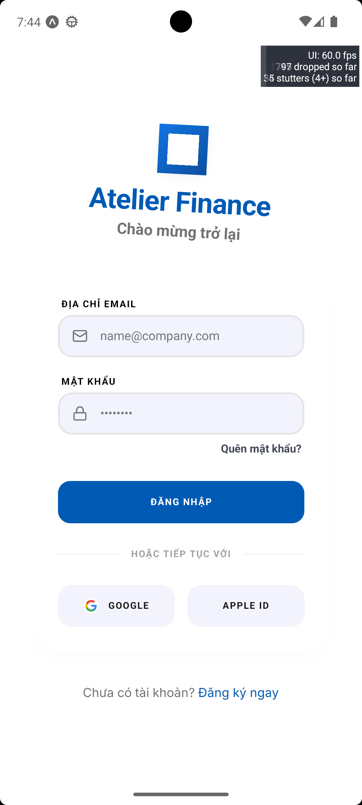
> 

> Hình F.3 — Màn hình đăng ký
>
> 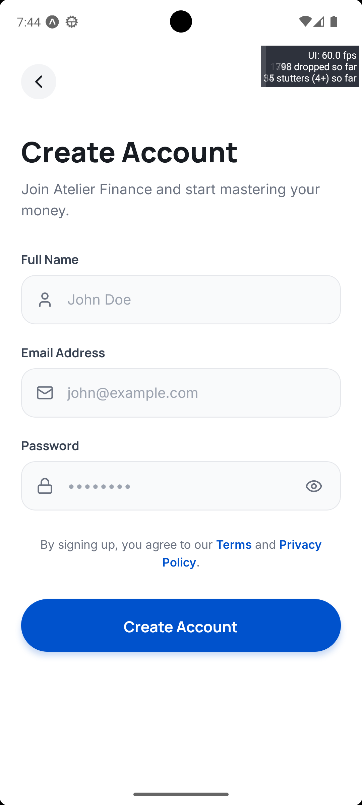
> 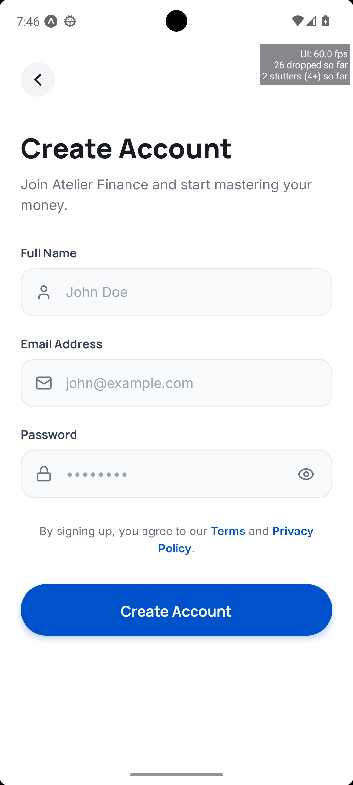

### 2. Các chức năng quản lý tài chính chính
> Hình F.4 — Màn hình tổng quan (Dashboard)
>
> 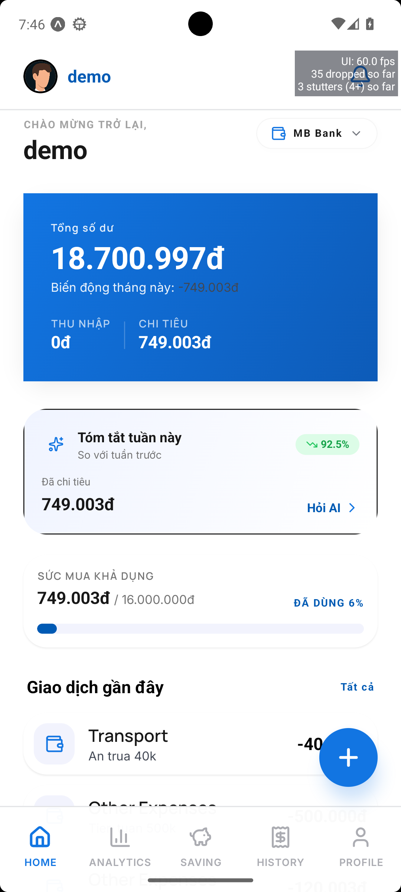

> Hình F.5 — Màn hình lịch sử giao dịch
>
> 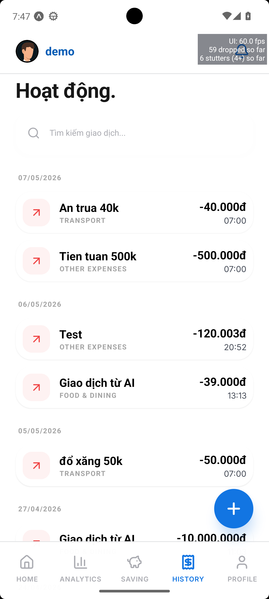

> Hình F.6 — Màn hình thêm và lưu giao dịch
>
> 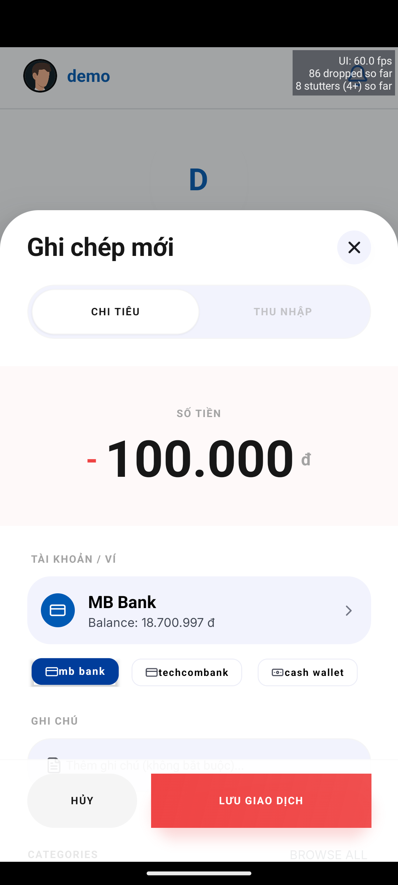
> 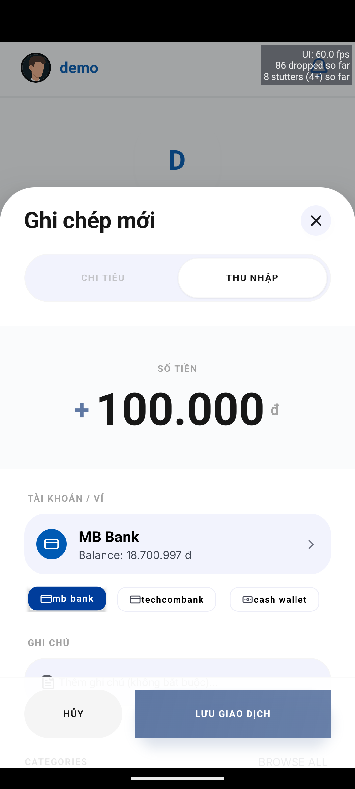

> Hình F.7 — Màn hình thống kê (Analytics)
>
> 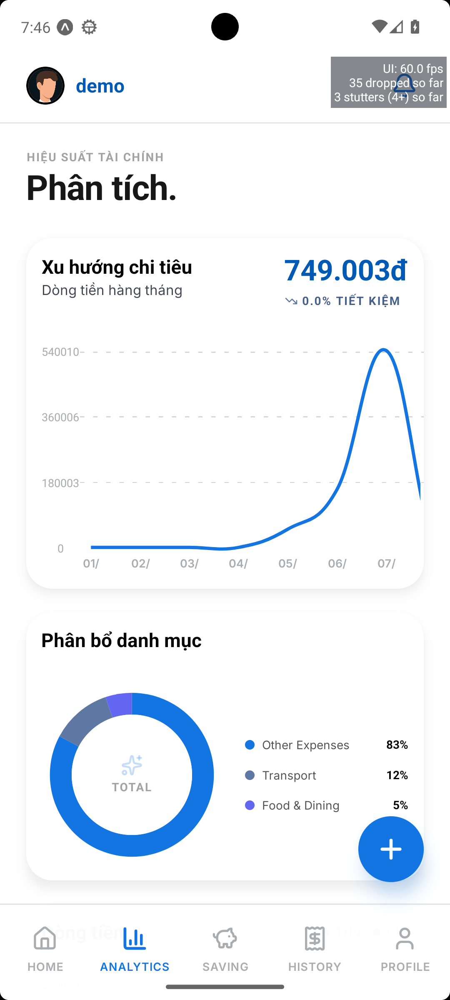

> Hình F.8 — Màn hình ngân sách (Budget)
>
> 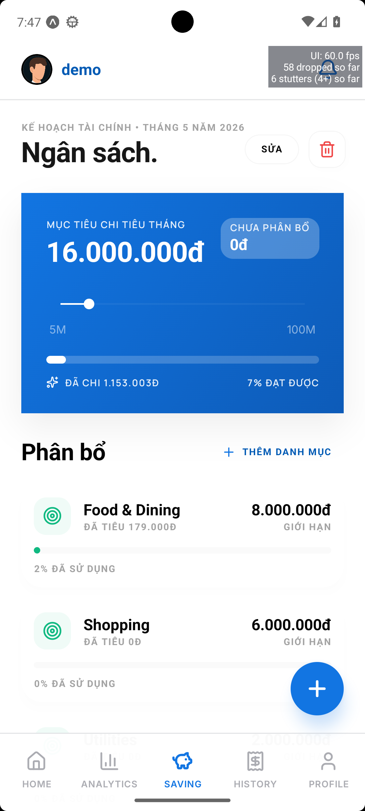

> Hình F.9 — Màn hình cá nhân (Profile)
>
> 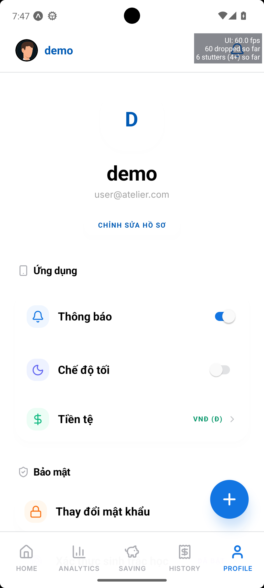

### 3. Tích hợp AI
> Hình F.10 — Màn hình hỏi đáp với Atelier AI (Chat)
>
> 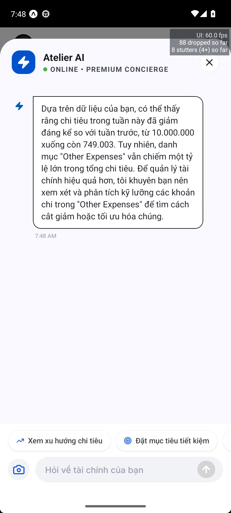

> Hình F.11 — Phân tích dữ liệu giao dịch bằng AI
>
> 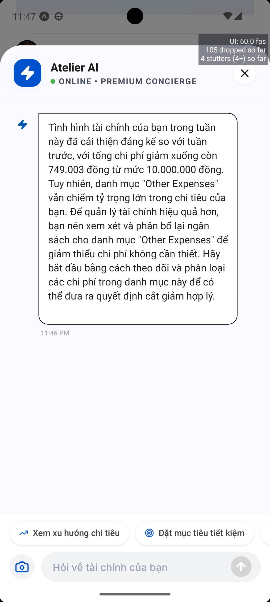

---

Ghi chú hoàn thiện báo cáo: Trước khi nộp bản chính thức, nhóm cần bổ sung đầy đủ tên trường, tên giảng viên hướng dẫn, ảnh minh họa giao diện, đường dẫn repository/video demo và kiểm tra lại toàn bộ liên kết, chú thích hình, bảng biểu để đảm bảo tính hoàn chỉnh của tài liệu.