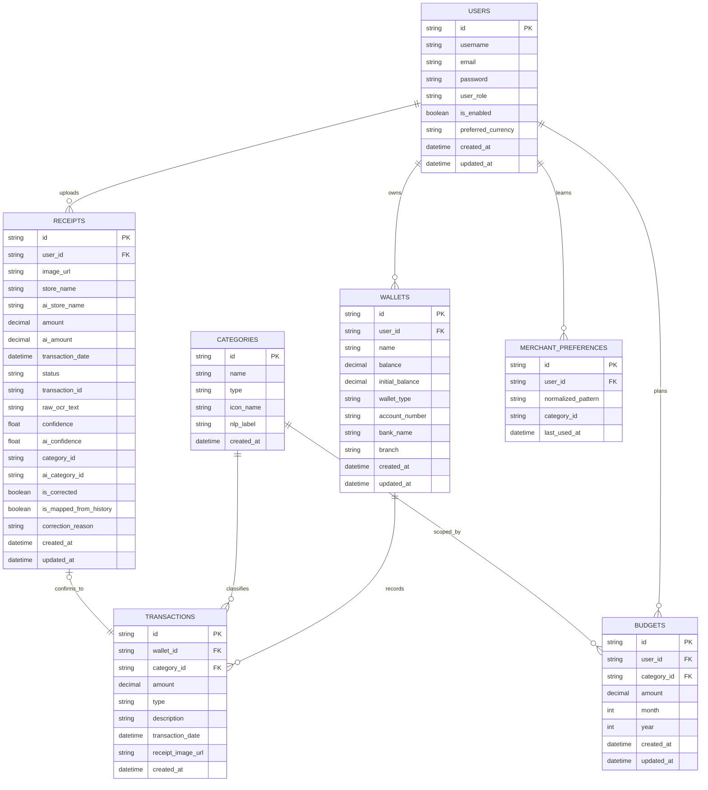
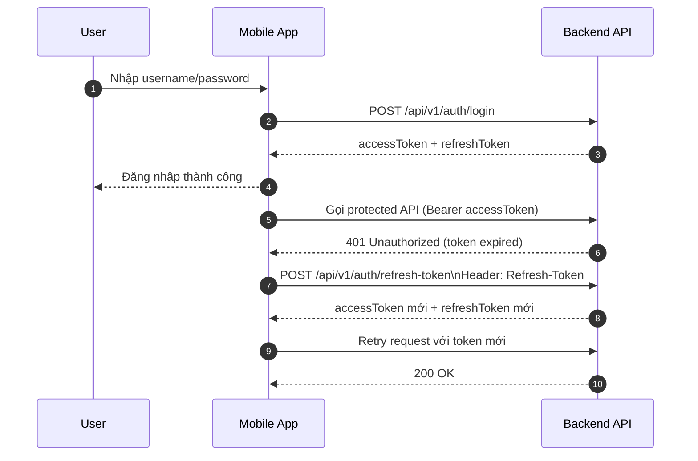
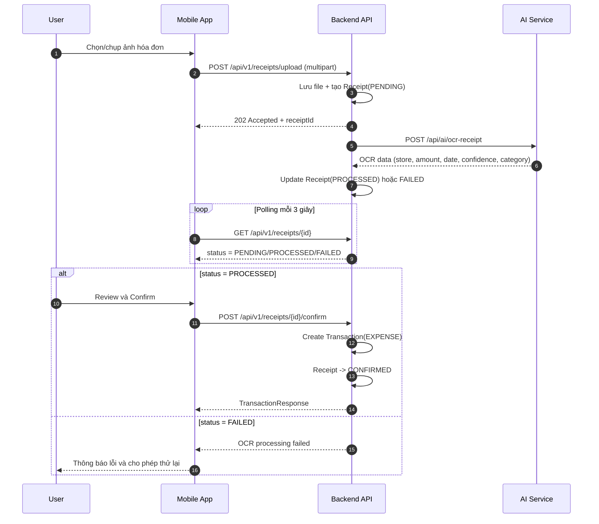
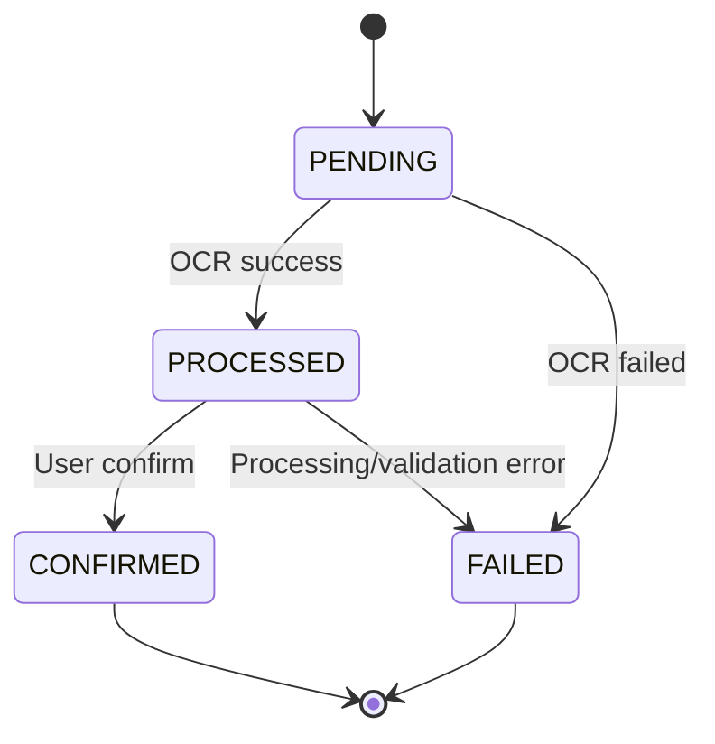
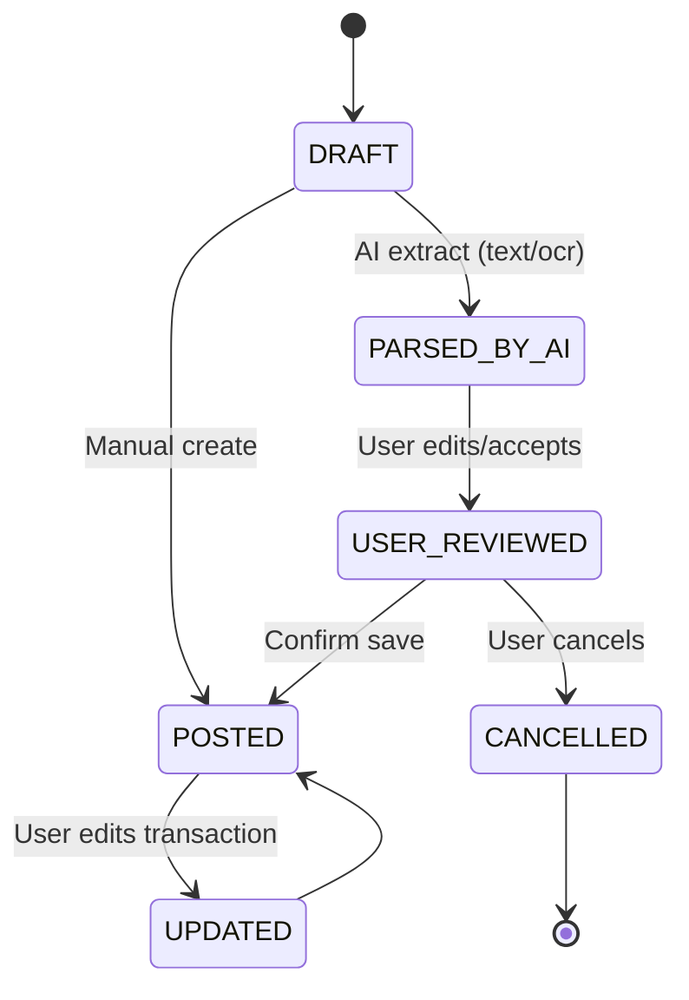
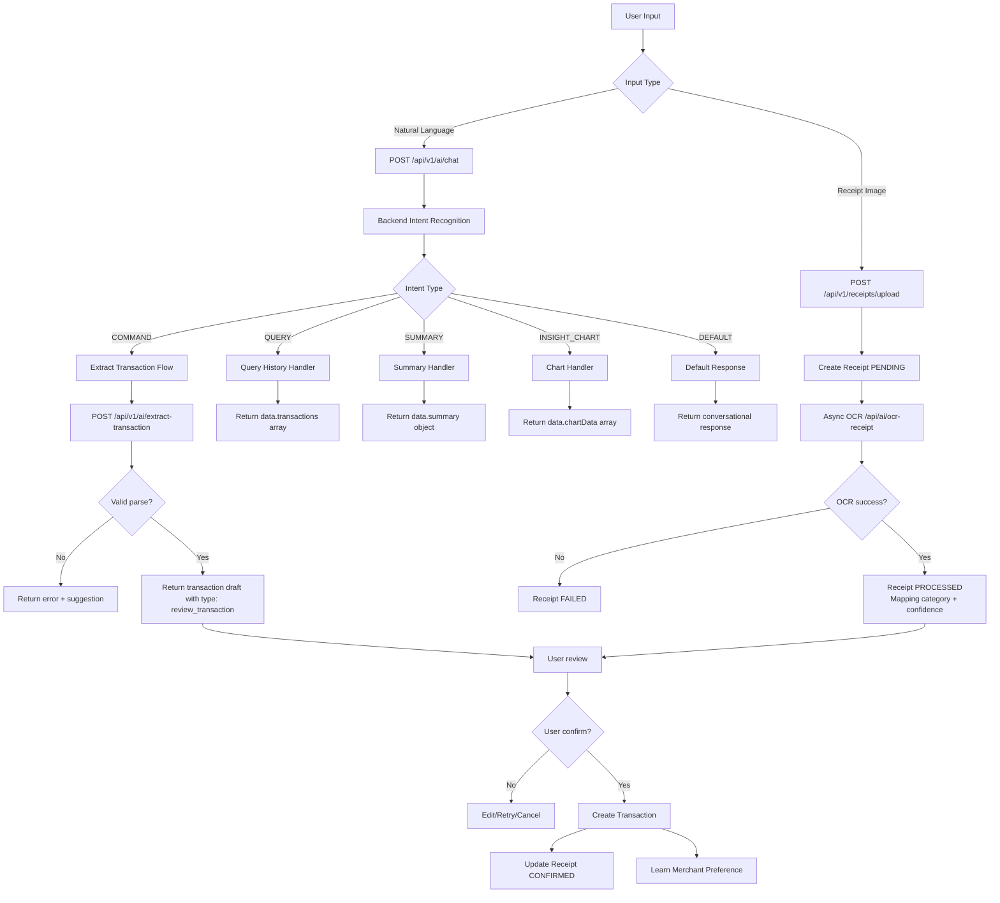

# WORKFLOWS

> Related documents:
> - [Documentation Index](./README.md)
> - [Features](./FEATURES.md)
> - [Use Cases](./USE_CASES.md)

Tài liệu trực quan hóa các luồng nghiệp vụ và kỹ thuật bằng Mermaid cho hệ thống **Smart Personal Finance Management System**.

---

## WF-01
### ERD — Core Business Entities

**Liên kết nghiệp vụ**

- Features: [F-02](./FEATURES.md#f-02), [F-03](./FEATURES.md#f-03), [F-04](./FEATURES.md#f-04), [F-05](./FEATURES.md#f-05), [F-08](./FEATURES.md#f-08)
- Use cases: [UC-02](./USE_CASES.md#uc-02), [UC-03](./USE_CASES.md#uc-03), [UC-06](./USE_CASES.md#uc-06), [UC-07](./USE_CASES.md#uc-07)

---

## WF-02
### Sequence — Login & Refresh Token Flow

**Liên kết nghiệp vụ**

- Features: [F-01](./FEATURES.md#f-01), [F-09](./FEATURES.md#f-09)
- Use case: [UC-01](./USE_CASES.md#uc-01)

---

## WF-03
### Sequence — Receipt OCR Async & Confirm Transaction

**Liên kết nghiệp vụ**

- Features: [F-08](./FEATURES.md#f-08), [F-09](./FEATURES.md#f-09)
- Use case: [UC-06](./USE_CASES.md#uc-06)

---

## WF-04
### State — Receipt Lifecycle

**Liên kết nghiệp vụ**

- Feature: [F-08](./FEATURES.md#f-08)
- Use case: [UC-06](./USE_CASES.md#uc-06)

---

## WF-05
### State — Transaction Business State (Documentation-level)

> Lưu ý: đây là **business state** ở mức tài liệu nghiệp vụ. Entity `Transaction` hiện tại chưa lưu field state riêng trong DB.

**Liên kết nghiệp vụ**

- Feature: [F-03](./FEATURES.md#f-03)
- Use cases: [UC-03](./USE_CASES.md#uc-03), [UC-05](./USE_CASES.md#uc-05)

---

## WF-06
### Flowchart — AI Processing & Error Handling

**Key Changes**
- ⭐ Unified `/api/v1/ai/chat` endpoint handles all natural language inputs
- Backend performs intent recognition (no client-side regex)
- Standardized response contract with `type` and `data` fields
- `data.transactions` replaces `matchedTransactions`
- Fallback to extract flow when intent is `COMMAND`

**Liên kết nghiệp vụ**

- Features: [F-07](./FEATURES.md#f-07), [F-08](./FEATURES.md#f-08)
- Use cases: [UC-04](./USE_CASES.md#uc-04), [UC-05](./USE_CASES.md#uc-05), [UC-06](./USE_CASES.md#uc-06), [UC-08](./USE_CASES.md#uc-08)

---

## Verification Checklist

- [ ] Mermaid render đúng trên GitHub.
- [ ] Mermaid render đúng trên VSCode.
- [ ] Tên API trong sơ đồ khớp với controller hiện tại (`/api/v1/*`).
- [ ] Luồng OCR phản ánh đúng trạng thái `PENDING -> PROCESSED -> CONFIRMED/FAILED`.
- [ ] Luồng transaction state có chú thích rõ là business-level.
